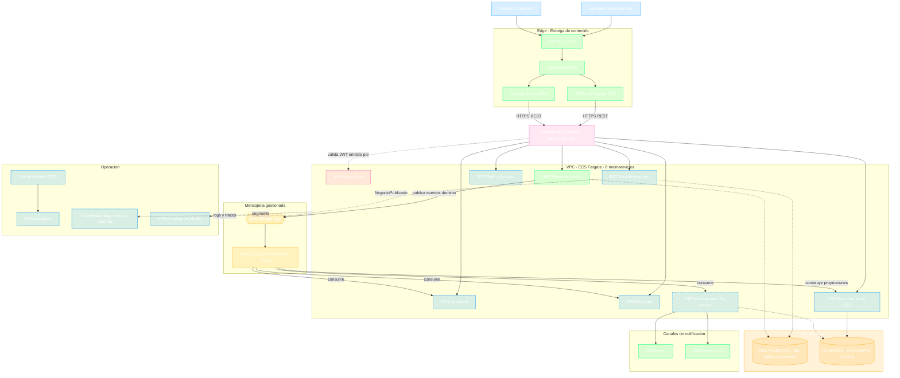

# ☁️ Arquitectura AWS — app-barber

| Campo | Valor |
|-------|-------|
| **Proyecto** | app-barber |
| **Fecha** | 2026-08-23 |
| **Versión** | 1.0 |
| **Estado** | ✅ Vigente — derivada de decisiones aceptadas |
| **ADRs origen** | [ADR-001](artifacts/ADR/ADR-001-adopcion-microservicios.md) · [ADR-002](artifacts/ADR/ADR-002-stack-poliglota-acotado.md) · [ADR-003](artifacts/ADR/ADR-003-plataforma-cloud-aws.md) |

---

## 1. Paisaje Completo en AWS

---

## 2. Mapeo Servicio → Recurso AWS

| Servicio | Tecnología (ADR-002) | Cómputo | Integración | Persistencia |
|----------|---------------------|---------|-------------|--------------|
| IAM | Java · Spring Boot | Fargate service | Emisor OIDC para autorizador de API GW | RDS · bd `iam` |
| EST | Java · Spring Boot | Fargate service | Detrás de API GW | RDS · bd `establecimientos` |
| STF | Java · Spring Boot | Fargate service | Detrás de API GW | RDS · bd `staff` |
| RES ⭐ | Java · Spring Boot | Fargate service | Detrás de API GW · publica a EventBridge (patrón outbox) | RDS · bd `reservas` |
| CPN | Java · Spring Boot | Fargate service | Cola SQS `cpn-citas-completadas` | RDS · bd `cuponera` |
| RSN | Java · Spring Boot | Fargate service | Cola SQS `rsn-citas-completadas` | RDS · bd `resenas` |
| DSC | Java · Spring Boot | Fargate service | API GW lectura · colas SQS para proyecciones | DynamoDB tabla proyecciones |
| NTF | **Go** | Fargate worker (sin inbound) | Colas SQS de eventos | DynamoDB envíos |
| Front Cliente | Next.js | Fargate + CloudFront | Consumo API GW | — |
| Portal Negocio | Angular SPA | S3 + CloudFront | Consumo API GW | — |

---

## 3. Pipeline CI/CD (patrón por servicio)

```mermaid
graph LR
    P["Push a GitHub"] --> T["Tests unitarios e integracion"]
    T --> B["Build imagen Docker"]
    B --> E["Push a ECR"]
    E --> TF["terraform apply workspace"]
    TF --> D["ECS rolling deploy"]
    D --> S["Smoke tests contra API GW"]
    S --> OK["Despliegue sano"]

    classDef stage fill:#0096FF26,stroke:#0096FF,color:#fff
    classDef aws fill:#FFA50026,stroke:#FFA500,color:#fff

    class P,T,B stage
    class E,TF,D,S,OK aws
```

Convenciones:

- Pipeline idéntico para los 8 servicios (template compartido) — solo cambia nombre/contexto
- Ambientes `dev` y `prod` como workspaces de Terraform; `prod` requiere aprobación manual
- Imagen por commit en `main`; tag = versión desplegada = capacidad de rollback inmediato

---

## 4. Desarrollo Local

| Aspecto | Estrategia |
|---------|-----------|
| Servicios Java | Ejecución local directa + docker-compose con PostgreSQL (script crea las BDs lógicas) |
| Mensajería | Puerto de mensajería en código con dos adaptadores: in-memory (tests) y SQS; ElasticMQ para integración local |
| Frontends | `npm run dev` estándar apuntando a servicios locales o al ambiente dev en AWS |
| Regla | Lo que corre en local debe correr igual en AWS — la IaC es la única diferencia de entorno |

---

## 5. Control de Costos (obligatorio — ver ADR-003 §Estimación)

- ✅ Presupuesto con alarmas ($50 aviso / $120 alerta) activo **antes** del primer despliegue
- ✅ Apagado nocturno/fin de semana del ambiente dev vía schedules de ECS
- ✅ Fargate Spot en dev
- ✅ Revisión de costos en cada cierre de fase

---

✅ Revisado por Javier Garcia
