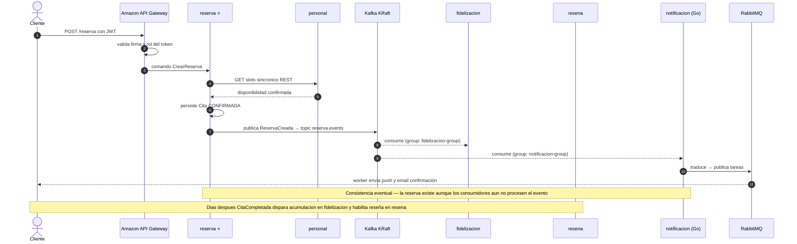

# ADR-001 — Adopción de Arquitectura de Microservicios desde el Inicio

- **Estado:** ✅ Aceptada
- **Decisores:** Javier Garcia (Product Owner), Onad (Arquitecto de Software)
- **Fecha:** 2026-08-23
- **ADR Número:** 001

---

## Contexto y Problema

app-barber es un proyecto personal con doble objetivo declarado: **(1)** crecimiento profesional mediante práctica real de tecnologías y patrones nuevos, y **(2)** posibilidad de llevar el producto a producción (marketplace bilateral de reservas barbería/belleza).

Condiciones del contexto:

- Equipo de **2 personas** — experiencia: Java/Spring Boot, Angular, DevOps básico
- Infraestructura inexistente (greenfield, sin legado)
- Dominio con **7 bounded contexts claramente identificados** (épicas E1–E7)
- El objetivo formativo fue revelado *después* del análisis original (`vision_producto.md` §12), que recomendaba Monolito Modular optimizando time-to-market. Al activarse el objetivo de aprendizaje (escenario B), la función de optimización cambió y la decisión fue reabierta y debatida formalmente.

---

## Drivers de Decisión

- **D1 — Objetivo formativo primario:** practicar patrones distribuidos reales (contratos entre servicios, consistencia eventual, mensajería, observabilidad distribuida, IaC)
- **D2 — Posible producción:** la topología no debe exigir migración estructural si el producto crece
- **D3 — Fronteras naturales:** el dominio ya posee bounded contexts claros alineados a las épicas
- **D4 — Greenfield + equipo conocedor de conceptos MS:** sin legado que condicione; curva conceptual baja
- **D5 — Riesgo conocido:** los proyectos personales mueren por dispersión de infraestructura, no por falta de ideas

---

## Opciones Consideradas

1. **Monolito Modular** — un despliegue, módulos con fronteras explícitas, eventos in-process (recomendación original §12)
2. **MS-Lite** — monolito modular como Core API + worker de notificaciones (2 despliegues)
3. **Microservicios completos** — un servicio por bounded context + servicios de plataforma

---

## Decisión

**Opción elegida: Microservicios completos**, construidos por fases verticales con guardarrails obligatorios.

> **Refinamiento sobre la validación inicial:** el rol de gateway lo asume el servicio gestionado **Amazon API Gateway**, eliminando el microservicio custom de gateway previsto. El paisaje real queda en **8 servicios custom** (7 de dominio + identidad).

### Descomposición de servicios

| Servicio | Origen | Responsabilidad | Datos que posee |
|----------|--------|----------------|-----------------|
| identidad | Plataforma | Identidad, JWT, roles (cliente/dueño/barbero/admin) | Usuario, Rol |
| establecimiento | E1 | Negocios, sedes, horarios, catálogo, métodos de pago | Negocio, Sede, Servicio |
| personal | E2 | Barberos, jornadas, disponibilidad | Barbero, Jornada |
| reserva ⭐ | E4 | Ciclo de vida de citas (núcleo) | Cita |
| fidelizacion | E6 | Plantillas fidelización, contadores, redención | Regla, AcumuladorVisitas |
| resena | E7 | Reseñas verificadas, rating, moderación | Reseña |
| descubrimiento | E3 | Búsqueda/fichas vía **proyecciones CQRS** | Proyecciones (sin datos fuente) |
| notificacion | E5 | Recordatorios, email/push | Preferencias, Envíos |

### Guardarrails obligatorios (anti-dispersión)

1. **Máximo 2 lenguajes backend** (ver ADR-002)
2. **Mensajería híbrida** (Kafka KRaft + RabbitMQ, ver [ADR-008](ADR-008-mensajeria-hibrida-kafka-rabbitmq.md)) — Kafka para eventos de dominio, RabbitMQ para tareas de trabajo
3. **IaC desde la primera línea** (Terraform) — la consola AWS nunca es fuente de verdad
4. **Construcción por fases verticales** — cada fase termina con un flujo E2E desplegado y estable:
   - **Fase 0 · Fundamentos:** repositorios, pipeline patrón CI/CD, Terraform base, entorno local docker-compose, observabilidad mínima
   - **Fase 1 · Núcleo reservable:** identidad + establecimiento + personal + reserva + notificación → flujo *descubrir → reservar → notificar* E2E en AWS
   - **Fase 2 · Fidelización:** fidelizacion + resena + descubrimiento → MVP funcional completo
   - **Fase 3 · Endurecimiento:** trazabilidad completa, alarmas, hardening, portal admin
5. **Regla de parada:** ninguna fase inicia sin la anterior E2E desplegada

---

## Consecuencias

### Positivas

- Aprendizaje real y demostrable de patrones distribuidos con un producto motivador
- Escalado independiente listo ante crecimiento real del negocio
- Desacoplamiento forzado por la red — imposible hacer trampa arquitectónica
- Cada servicio funciona como pieza individual de portafolio profesional

### Negativas

- **Impuesto operativo diario:** 8 pipelines, debugging distribuido, versionado de contratos contra uno mismo
- Costo cloud superior al monolito (~$100–170/mes a plena operación; ver `arquitectura_aws.md`)
- Riesgo de abandono por dispersión — mitigado por guardarrails y fases verticales
- Menor velocidad de iteración inicial comparada con monolito

---

## Diagrama

Flujo distribuido de reserva — la complejidad que se acepta conscientemente:

---

## Validación

- **Fase 1 exitosa cuando:** el flujo descubrir→reservar→notificar corre E2E en AWS con trazabilidad visible
- **Métrica de salud del proyecto:** ≥ 1 flujo E2E desplegable por mes durante la construcción
- **Escala de retroceso definida:** si al cierre de Fase 1 el impuesto operativo bloquea el avance, se consolida progresivamente (primero personal dentro de reserva; luego establecimiento+personal+reserva) documentándolo en nuevo ADR

---

## Pros y Contras de las Opciones

### Monolito Modular

Un único despliegue con fronteras internas explícitas y eventos in-process.

- ✅ Bueno, porque maximiza velocidad de iteración con equipo de 2
- ✅ Bueno, porque minimiza costo operativo e infraestructura
- ❌ Malo, porque no satisface el driver D1 (aprendizaje de patrones distribuidos reales)
- ❌ Malo, porque pospone sine die la práctica de mensajería/trazabilidad distribuida

### MS-Lite

Monolito modular + worker de notificaciones desplegados independientemente.

- ✅ Bueno, porque introduce práctica real de broker y pipelines múltiples con 15% del impuesto
- ✅ Bueno, porque mantiene rápido el núcleo crítico
- ❌ Malo, porque cubre solo parcialmente D1 (un único contrato async real)
- ❌ Malo, porque hereda casi toda la complejidad de decisión sin todo su beneficio formativo

### Microservicios completos *(elegida)*

Un despliegue por bounded context + servicios de plataforma.

- ✅ Bueno, porque satisface plenamente D1 y D2
- ✅ Bueno, porque explota las fronteras naturales ya existentes (D3)
- ❌ Malo, porque maximiza el impuesto operativo diario (mitigado por guardarrails)
- ❌ Malo, porque eleva el riesgo de abandono (mitigado por fases verticales y escala de retroceso)

---

## Más Información

- Debate completo de diseño: sesión del 2026-08-23 (monolito modular → MS tras revelación del objetivo formativo)
- `artifacts/vision_producto.md` — §7 evento dominante del dominio; §12 análisis histórico
- `arquitectura_aws.md` — materialización en AWS

---

## ADRs Relacionados

- [ADR-002 — Stack Poliglota Acotado](ADR-002-stack-poliglota-acotado.md)
- [ADR-003 — Plataforma Cloud AWS](ADR-003-plataforma-cloud-aws.md)

---

✅ Revisado por Javier Garcia
