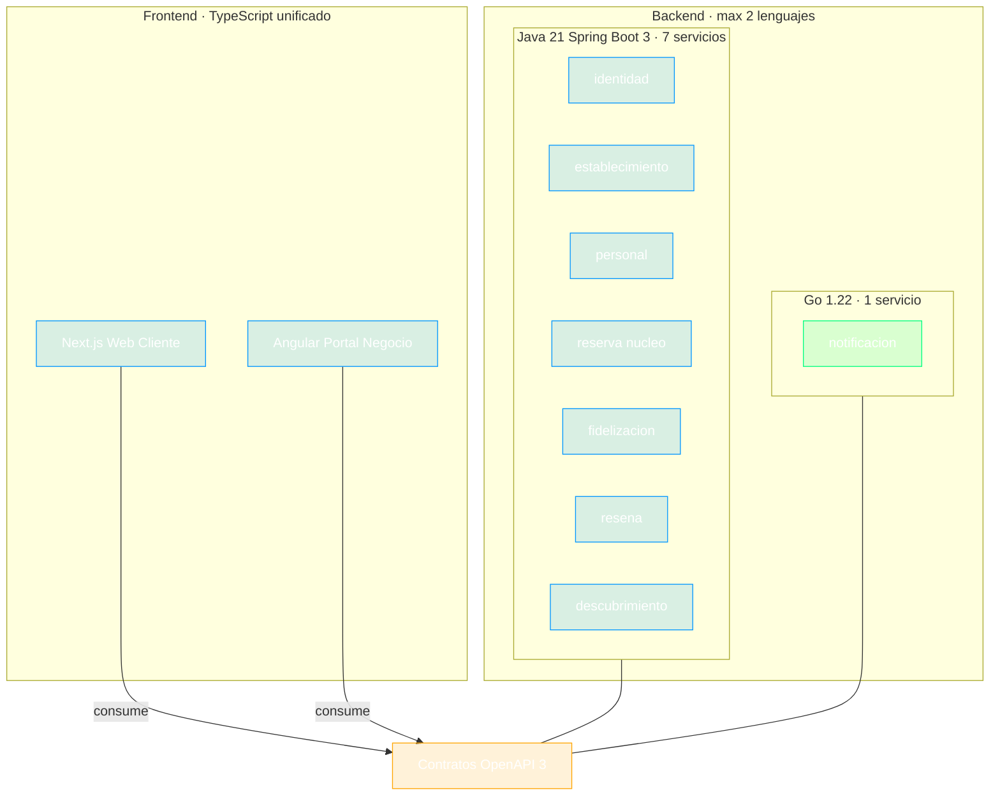

# ADR-002 — Stack Poliglota Acotado

- **Estado:** ✅ Aceptada
- **Decisores:** Javier Garcia (Product Owner), Onad (Arquitecto de Software)
- **Fecha:** 2026-08-23
- **ADR Número:** 002

---

## Contexto y Problema

Los microservicios ([ADR-001](ADR-001-adopcion-microservicios.md)) requieren asignación tecnológica concreta. El equipo (2 personas, experiencia Java/Spring Boot + Angular + DevOps básico) declaró objetivos de aprendizaje explícitos: **probar Go**, **probar Next.js/React**, **profundizar Angular** — manteniendo la posibilidad real de llevar el producto a producción.

Pregunta central: ¿cómo satisfacer los deseos formativos sin convertir el proyecto en un zoológico inmantenable?

---

## Drivers de Decisión

- **D1:** Cubrir los aprendizajes deseados (Go, React/Next.js, Angular profundo) con exposición *real*, no tutorial
- **D2:** Proteger la entrega: el núcleo del negocio se construye sobre la fortaleza existente (Java/Spring Boot)
- **D3:** Límite duro anti-caos para equipo de 2: **máximo 2 lenguajes de backend**
- **D4:** Contratos estables entre tecnologías heterogéneas

---

## Opciones Consideradas

1. **Monolingüe Java** — todo el backend en Spring Boot
2. **Poliglota amplia** — Go + Java + .NET o Python según servicio
3. **Poliglota acotada** — Java dominante + Go en un servicio periférico; TypeScript unifica frontends

---

## Decisión

**Opción elegida: Poliglota acotada.**

| Componente | Tecnología | Servicios / Alcance | Justificación |
|-----------|------------|--------------------|---------------|
| Núcleo backend (identidad, establecimiento, personal, reserva, fidelizacion, resena, descubrimiento) | **Java 21 · Spring Boot 3** | 7 servicios | Velocidad donde importa; profundiza expertise existente; ecosistema maduro para outbox/JPA/security |
| Worker de notificaciones | **Go 1.22+** | notificacion | Scope pequeño y periférico = primer proyecto Go idiomático real (consumidor de colas, concurrencia) |
| Web Cliente | **Next.js 14+ · TypeScript** | Frontend público | Nuevo stack solicitado, riesgo contenido; SSR/SEO para fichas públicas de negocios |
| Portal Negocio | **Angular 17+** | Back-office dueños/barberos/admin | Profundiza stack conocido construyendo la UI más compleja |
| Contratos | **OpenAPI 3** | Todos los servicios | Única fuente de verdad entre lenguajes; genera clientes/servidores |

### Reglas de protección

1. Máximo **2 lenguajes backend** — un tercer lenguaje requiere nuevo ADR
2. La comunicación entre servicios **solo por OpenAPI o eventos** — nunca librerías compartidas de dominio entre lenguajes
3. Frameworks alternativos dentro del mismo lenguaje requieren justificación documentada (no ADR completo)

---

## Consecuencias

### Positivas

- Los cuatro deseos formativos quedan cubiertos con producción real (D1 ✓)
- El 87% del código backend (7/8 servicios) usa la tecnología dominada → riesgo contenido (D2 ✓)
- Go se aprende en el caso de uso donde brilla (concurrencia, colas) con blast-radius mínimo
- TypeScript como único lenguaje frontend reduce cambio de contexto UI

### Negativas

- Dos runtimes que mantener en pipelines e imágenes (mitigado: pipeline template único parametrizado)
- Curva Go inicial ralentiza solo notificacion (aceptado: es parte del objetivo)
- Dos mentalidades de tipado/modelado (Java OOP vs Go idiomatic) — disciplina de fronteras obligatoria

---

## Diagrama

---

## Validación

- Primer PR productivo en Go (notificacion consumiendo cola real) dentro de las 2 primeras semanas de Fase 1
- Cero fugas de dominio: ningún tipo/lógica de negocio compartido por librería entre lenguajes (revisión en cada PR)
- Contratos OpenAPI versionados y publicados por servicio desde Fase 0

---

## Pros y Contras de las Opciones

### Monolingüe Java

Todo el backend en Spring Boot.

- ✅ Bueno, porque minimiza fricción operativa y curvas
- ❌ Malo, porque ignora los drivers formativos D1 (ni Go ni diversidad real)
- ❌ Malo, porque pierde la oportunidad de comparar paradigmas en contexto real

### Poliglota amplia

Asignar lenguajes variados (.NET, Python/FastAPI) según afinidad percibida de cada servicio.

- ✅ Bueno, porque maximiza variedad formativa superficial
- ❌ Malo, porque viola D3: 3+ lenguajes backend con 2 personas es caos operativo garantizado
- ❌ Malo, porque fragmenta convenciones, pipelines y debugging sin beneficio profundo

### Poliglota acotada *(elegida)*

Java dominante + Go periférico + TypeScript en ambos frontends.

- ✅ Bueno, porque equilibra entrega (D2) y aprendizaje (D1) con regla clara (D3)
- ✅ Bueno, porque cada lenguaje ocupa su caso de uso idiomático
- ❌ Malo, porque aún duplica algo de esfuerzo de plataforma (aceptado y mitigado)

---

## Más Información

- Roadmap oficial de Go — tour y patrones de concurrencia recomendados previos a Fase 1
- Convención de proyectos: repositorio monorepo con carpeta por servicio (ver estructura en `arquitectura_aws.md` y conversación de diseño)

---

## ADRs Relacionados

- [ADR-001 — Adopción de Microservicios](ADR-001-adopcion-microservicios.md)
- [ADR-003 — Plataforma Cloud AWS](ADR-003-plataforma-cloud-aws.md)

---

✅ Revisado por Javier Garcia
