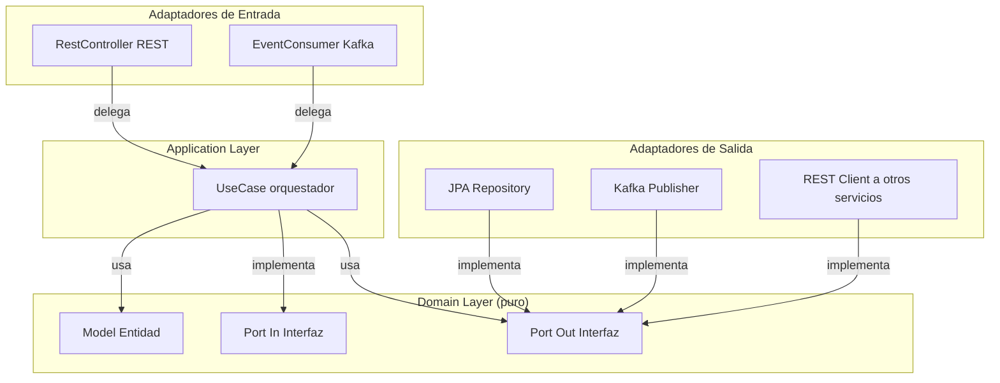

# ADR-004 — Arquitectura Interna Hexagonal Ligera

- **Estado:** ✅ Aceptada
- **Decisores:** Javier Garcia (Product Owner), Onad (Arquitecto de Software)
- **Fecha:** 2026-08-24
- **ADR Número:** 004

---

## Contexto y Problema

Cada microservicio del backend en Java (ADR-002) carece de convención interna sobre cómo estructurar su código. Sin estándar, la auto-inspección y la inspectibilidad entre servicios colapsan — cada uno se convierte en un micro-monolito opaco con su propio estilo. El equipo necesita una convención de arquitectura interna que:

1. Sea ampliamente usada en la industria (transferible)
2. Permita probar lógica de negocio sin levantar Spring ni bases de datos
3. Facilite el reemplazo de adaptadores sin tocar el dominio
4. No agregue complejidad innecesaria (equipo de 2)

---

## Drivers de Decisión

- **D1:** Transferibilidad — el patrón debe ser recognizable y used en la industria
- **D2:** Testabilidad — lógica de negocio testeable sin infraestructura
- **D3:** Separación de responsabilidades — dominio puro vs. adaptadores externos
- **D4:** Simplicidad — no sobre-ingenierar para un equipo de 2

---

## Opciones Consideradas

1. **Service + Controller tradicional** — paquetes `controller/service/repository` (convención Spring clásica)
2. **Hexagonal completa (Ports & Adapters)** — separación rigurosa de puertos primarios/secundarios con interfaces explícitas
3. **Hexagonal Ligera** — Hexagonal simplificada con package por capa + adaptadores concretos

---

## Decisión

**Opción elegida: Hexagonal Ligera** (adaptación pragmática de Hexagonal completa).

### Principios clave

- **Dominio puro** (Domain): entidades, casos de uso, puertos (interfaces de entrada/salida) — cero dependencias de Spring o framework
- **Adaptadores** (Adapters): implementaciones concretas de puertos (JPA, REST, Kafka, RabbitMQ) — única capa con dependencias de framework
- **Application** (Application): orquestación de adaptadores y configuración — punto de entrada Spring Boot

### Paquetes por servicio Java

```
com.sillalibre.{servicio}/
├── domain/
│   ├── model/          # Entidades de dominio puras
│   └── ports/          # Interfaces de entrada (in) y salida (out)
├── application/
│   ├── usecase/        # Orquestadores de lógica
│   └── config/         # Configuración de Spring
└── adapters/
    ├── inbound/
    │   ├── rest/       # Controllers REST (API Gateway → servicio)
    │   └── event/      # Consumidores Kafka (eventos entrantes)
    └── outbound/
        ├── persistence/ # Repositorios JPA (implementan puertos out)
        ├── messaging/   # Publicación Kafka (implementa puerto out)
        └── rest/        # Clientes HTTP a otros servicios (implementa puerto out)
```

### Ejemplo — CrearReserva en reserva

```java
// ===== domain/ports/in/CrearReservaPort.java =====
public interface CrearReservaPort {
    ReservaId ejecutar(CrearReservaComando cmd);
}

// ===== domain/model/Reserva.java (entidad pura) =====
public class Reserva {
    private ReservaId id;
    private ClienteId clienteId;
    private SedeId sedeId;
    private BarberoId barberoId;
    private DateTime fechaHora;
    private ReservaEstado estado;
    // ... métodos de negocio: confirmar(), cancelar(), ...
}

// ===== application/usecase/CrearReservaUseCase.java =====
@ApplicationService
public class CrearReservaUseCase implements CrearReservaPort {
    private final DisponibilidadPort disponibilidad;
    private final ReservaRepositoryPort repositorio;
    private final EventoReservaPort eventos;

    @Override
    public ReservaId ejecutar(CrearReservaComando cmd) {
        if (!disponibilidad.estaDisponible(cmd.barberoId(), cmd.fechaHora())) {
            throw new SlotNoDisponibleException();
        }
        Reserva reserva = Reserva.crear(cmd);
        repositorio.guardar(reserva);
        eventos.publicar(new ReservaCreadaEvent(reserva));
        return reserva.getId();
    }
}

// ===== adapters/outbound/messaging/KafkaReservaPublisher.java =====
@Component
public class KafkaReservaPublisher implements EventoReservaPort {
    private final KafkaTemplate<String, Object> kafkaTemplate;
    // ... implementa publicación via Kafka producer
}
```

### Convenciones

| Convención | Regla |
|------------|-------|
| Nombre de paquete base | `com.sillalibre.{servicio}` (identidad, establecimiento, personal, reserva, fidelizacion, resena, descubrimiento, notificacion) |
| Puerto de entrada | Interfaz `*Port.java` en `domain/ports/in/` |
| Puerto de salida | Interfaz `*Port.java` en `domain/ports/out/` |
| Caso de uso | `@ApplicationService` en `application/usecase/` — implementa un puerto de entrada |
| Adaptador de entrada REST | `@RestController` en `adapters/inbound/rest/` — delega al caso de uso |
| Adaptador de salida JPA | `@Repository` en `adapters/outbound/persistence/` — implementa un puerto de salida |
| Entidad de dominio | Clase pura en `domain/model/` — sin anotaciones Spring ni JPA |

---

## Consecuencias

### Positivas

- La auto-inspección y la inspectibilidad se igualan entre servicios — cualquier dev reconoce la estructura inmediatamente
- El dominio se testea con unit tests puros (sin mocks de repositorios) en minutos
- Los adaptadores se reemplazan sin tocar la lógica de negocio (JPA → DynamoDB, REST → gRPC)
- El patrón es ampliamente reconocido en Java (transferible a cualquier proyecto Spring posterior)

### Negativas

- Mínima fricción inicial para estructurar cada servicio (aceptada: 30 minutos de boilerplate con `spring-init`)
- Un nivel de abstracción más que un monolito simple (aceptado: Hexagonal Ligera minimiza esto)

---

## Para servicios Go (notificacion)

La misma filosofía se aplica con paquetes idiomáticos de Go:

```
cmd/notificacion/main.go          # Entrada
internal/
├── domain/                       # Modelos y puertos (interfaces Go)
├── application/                   # Casos de uso (servicio de aplicación)
└── adapters/
    ├── inbound/event/             # Consumidores Kafka (event streaming)
    └── outbound/
        ├── persistence/           # DynamoDB
        └── rabbitmq/              # Publicador RabbitMQ (tareas de trabajo)
```

---

## Diagrama



---

## Validación

- Cada PR con cambio en domain/ debe pasar unit tests sin dependencias externas
- Puntos de verificación:
  - [ ] Ninguna clase en `domain/` tiene anotaciones Spring ni JPA
  - [ ] Ningún caso de uso en `application/` tiene anotaciones JPA ni dependencias de adaptadores concretos
  - [ ] Test unitario de dominio existe para cada caso de uso en `application/usecase/`
  - [ ] Un dev nuevo puede ubicar la lógica de negocio en < 5 minutos

---

## Pros y Contras de las Opciones

### Service + Controller tradicional

Paquetes `controller/service/repository`.

- ✅ Bueno, porque familiar para todos los devs Java
- ❌ Malo, porque no fuerza la separación dominio/infraestructura — la tentación de meter lógica en el service concreto es fuerte
- ❌ Malo, porque el dominio queda acoplado a Spring (difícil de testear unitariamente)

### Hexagonal completa

Separación rigurosa de puertos primarios/secundarios, interfaces explícitas para todo.

- ✅ Bueno, porque máxima separación y testabilidad
- ❌ Malo, porque para un equipo de 2 en proyecto personal es sobre-ingeniería — demasiadas interfaces y boilerplate
- ❌ Malo, porque la curva de aprendizaje ralentiza la iteración inicial

### Hexagonal Ligera *(elegida)*

Hexagonal simplificada con package por capa + adaptadores concretos.

- ✅ Bueno, porque equilibra separación y simplicidad
- ✅ Bueno, porque el patrón es recognizable (D1) y testeable (D2)
- ❌ Malo, porque requiere convenciones explícitas (mitigado: este ADR)

---

## ADRs Relacionados

- [ADR-001 — Adopción de Microservicios](ADR-001-adopcion-microservicios.md)
- [ADR-002 — Stack Poliglota Acotado](ADR-002-stack-poliglota-acotado.md)

---

✅ Revisado por Javier Garcia
