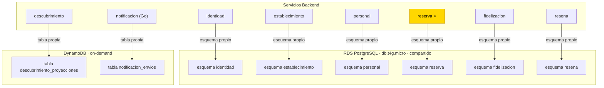

# ADR-005 — Persistencia y Estrategia de Datos

- **Estado:** ✅ Aceptada
- **Decisores:** Javier Garcia (Product Owner), Onad (Arquitecto de Software)
- **Fecha:** 2026-08-24
- **ADR Número:** 005

---

## Contexto y Problema

Cada microservicio del backend ([ADR-001](ADR-001-adopcion-microservicios.md)) necesita persistir datos con su propio modelo. La arquitectura de microservicios exige **base de datos por servicio** (Database per Service pattern) para garantizar desacoplamiento. Sin embargo, un equipo de 2 con techo de costo ~$125–150/mes ([ADR-003](ADR-003-plataforma-cloud-aws.md)) no puede pagar 8+ instancias de base de datos independientes.

**Pregunta central:** ¿cómo implementar la separación lógica de datos por servicio manteniendo la Economía de Fondos?

---

## Drivers de Decisión

- **D1:** Database per Service — separación lógica obligatoria para independencia de despliegue y escalado futuro
- **D2:** Economía de Fondos — un solo RDS compartido inicialmente; migración futura sin rediseño
- **D3:** No hacer trampa — cada servicio solo accede a su propia BD, nunca a la de otro servicio
- **D4:** Poliglota persistence — servicios con necesidades NoSQL (DynamoDB) vs. relacionales (PostgreSQL)

---

## Decisión

**Patrón: Database per Service + instancia compartida inicial + ruta de migración documentada.**

### Servicios y sus bases de datos

| Servicio | Base de datos | Tipo | Justificación |
|----------|---------------|------|---------------|
| identidad | `identidad` | RDS PostgreSQL | Usuarios, roles, credenciales |
| establecimiento | `establecimiento` | RDS PostgreSQL | Negocios, sedes, catálogo |
| personal | `personal` | RDS PostgreSQL | Barberos, jornadas, disponibilidad |
| reserva ⭐ | `reserva` | RDS PostgreSQL | Citas (núcleo del negocio) |
| fidelizacion | `fidelizacion` | RDS PostgreSQL | Reglas, acumuladores, historial |
| resena | `resena` | RDS PostgreSQL | Reseñas, ratings, moderación |
| descubrimiento | `descubrimiento` | DynamoDB | Proyecciones CQRS (lectura) |
| notificacion | `notificacion` | DynamoDB | Preferencias, envíos, historial |

### Topología inicial (Shared Infrastructure)

```
RDS PostgreSQL (db.t4g.micro, 20GB gp3)
├── esquema identidad     → tabla usuarios, roles
├── esquema establecimiento → tabla negocios, sedes, servicios
├── esquema personal      → tabla barberos, jornadas, disponibilidad
├── esquema reserva       → tabla citas, estados
├── esquema fidelizacion  → tabla reglas, acumuladores
└── esquema resena        → tabla reseñas, ratings

DynamoDB (on-demand)
├── tabla descubrimiento_proyecciones
└── tabla notificacion_envios
```

### Reglas de separación

1. **Cada servicio solo escribe en su propio esquema.** Nunca un servicio escribe en el esquema de otro servicio.
2. **Las lecturas cruzadas entre servicios se hacen por API, no por queries directas** — exceptions: consultas de dashboard admin pueden cruzar esquemas vía vista de solo lectura (read-only).
3. **Cada servicio usa su propio DataSource configurado** — HikariCP pool dedicado por servicio.
4. **Las migraciones de esquema (Flyway) se ejecutan por servicio** — cada servicio tiene su directorio `db/migration/` y solo migra su esquema.
5. **No hay foreign keys entre esquemas de distintos servicios** — la integridad referencial se maneja a nivel de aplicación/eventos.

### Connection Pool por servicio

```
HikariCP Pool por servicio:
├── maximumPoolSize = 6 (mínimo para db.t4g.micro compartido)
├── minimumIdle = 2
├── connectionTimeout = 30000ms
├── idleTimeout = 600000ms
└── maxLifetime = 1800000ms
```

**Total: 6 servicios × 6 conexiones = 36 conexiones** (con margen en el límite de 200 del db.t4g.micro).

### Flujo de una consulta跨servicio

```
reserva → (REST API) → personal
     ↓                    ↓
  esquema reserva    esquema personal
```

**Nunca:**
```
reserva → (SQL query) → personal.jornadas  ← PROHIBIDO
```

---

## Consecuencias

### Positivas

- Database per Service se cumple sin duplicar infraestructura (D1 ✓)
- Migración futura a RDS independiente = solo cambiar la cadena de conexión (no rediseño de esquemas)
- DynamoDB para descubrimiento y notificacion: costo ~$0–2/mes (on-demand) + caso de uso natural (acceso por clave, sin joins)
- Flyway por servicio: cada servicio migra independientemente

### Negativas

- Un solo db.t4g.micro es un **SPOF de persistencia** — mitigado con snapshots automáticos + réplica standby
- Las lecturas cruzadas de dashboard admin requieren vista read-only separada (esfuerzo adicional)
- La violación de separación por queries directas es tentadora — mitigada por la convención de HikariCP pools dedicados

---

## Ruta de Migración

**Hoy (fase piloto):**
```
RDS PostgreSQL → esquemas separados por servicio
DynamoDB → tablas separadas por servicio
```

**Cuando el tráfico lo justifique:**
```
Fase 1: Migrar reserva (crítico) a Aurora PostgreSQL independiente
Fase 2: Migrar identidad + establecimiento (alto uso) a Aurora PostgreSQL independiente
Fase 3: Mantener el shared RDS para servicios de bajo tráfico (fidelizacion, resena, personal)
```

**Trigger de migración:**
- Si la latencia del RDS compartido supera 100ms p95 durante 1 semana → migrar el servicio con más tráfico
- Si el número de conexiones supera 150 de 200 → reducir pool o migrar servicios críticos

---

## Diagrama



---

## Validación

- [ ] Cada servicio tiene su propio HikariCP DataSource configurado (no default)
- [ ] Flyway migra solo el esquema del servicio correspondiente
- [ ] No existen queries SQL que crucen esquemas de distintos servicios (excepto dashboard admin read-only)
- [ ] Snapshots de RDS se ejecutan diariamente
- [ ] DynamoDB tables tienen Point-in-Time Recovery habilitado

---

## ADRs Relacionados

- [ADR-001 — Adopción de Microservicios](ADR-001-adopcion-microservicios.md)
- [ADR-003 — Plataforma Cloud AWS](ADR-003-plataforma-cloud-aws.md)

---

✅ Revisado por Javier Garcia
