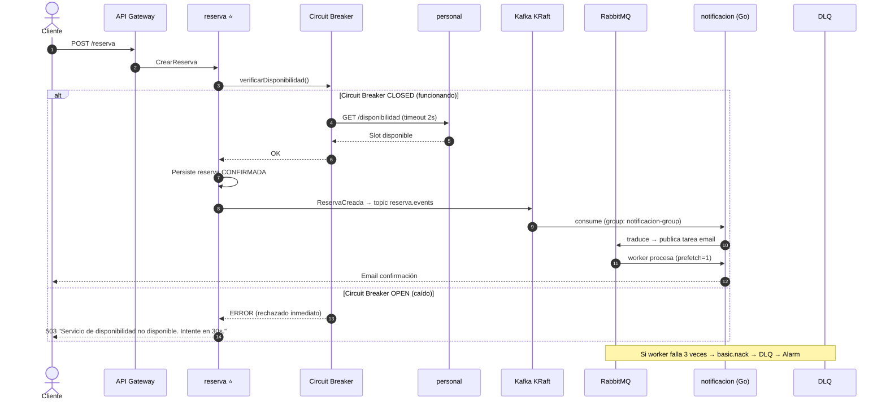

# ADR-006 — Tolerancia a Fallos entre Servicios

- **Estado:** ✅ Aceptada
- **Decisores:** Javier Garcia (Product Owner), Onad (Arquitecto de Software)
- **Fecha:** 2026-08-24
- **ADR Número:** 006

---

## Contexto y Problema

En arquitectura de microservicios ([ADR-001](ADR-001-adopcion-microservicios.md)), cada llamada entre servicios es una llamada de red que puede fallar. En el flujo de reserva, **reserva llama a personal** de forma síncrona para verificar disponibilidad antes de confirmar una cita. Si personal está caído o lento, reserva también cae → cascada de fallos.

El cambio del nombre de servicios del diseño original (STF → personal, RES → reserva) deja claro que estos servicios están acoplados de forma síncrona: **reserva depende de personal** para validar slots. Este acoplamiento crítico requiere tolerancia a fallos obligatoria.

---

## Drivers de Decisión

- **D1:** Flujos síncronos críticos deben ser tolerantes a fallos — un servicio caído no puede tumbar toda la plataforma
- **D2:** Degradación elegante — mejor ofrecer parcialidad que un error 500 al cliente
- **D3:** El JWT es validado por API Gateway — JWKS puede estar caído temporalmente → necesita caché local
- **D4:** Herramientas ya disponibles en Spring Boot — Resilience4j se integra nativamente con Spring Boot 3

---

## Opciones Consideradas

| Área | Opción A | Opción B | Opción C |
|------|----------|----------|----------|
| Llamadas síncronas | **Resilience4j** (timeout + circuit breaker + retry) | Istio/Envoy service mesh (auto-inject) | Intentar-siempre + fallback manual |
| JWKS/Token cache | **CloudFront cache** + TTL 5min | Lambda@Edge | Redis local |
| Colas de trabajo RabbitMQ | **Prefetch=1** + ACK manual + DLQ | Prefetch alto causaría procesamiento paralelo no deseado | Fallback a DLQ inmediato |

---

## Decisión

### Circuito entre reserva → personal

**Patrón: Circuit Breaker + Timeout + Retry con Resilience4j.**

```
reserva → [Timeout 2s] → [Retry ×3] → [Circuit Breaker] → personal
```

**Configuración:**

```yaml
resilience4j:
  circuitbreaker:
    instances:
      personal:
        slidingWindowSize: 10
        failureRateThreshold: 50
        waitDurationInOpenState: 30s
        permittedNumberOfCallsInHalfOpenState: 3
        automaticTransitionFromOpenToHalfOpenEnabled: true
        slowCallDurationThreshold: 2s
        slowCallRateThreshold: 80
  timelimiter:
    instances:
      personal:
        timeoutDuration: 2s
  retry:
    instances:
      personal:
        maxAttempts: 3
        waitDuration: 500ms
        enableExponentialBackoff: true
```

**Comportamiento por estado del circuit breaker:**

| Estado | Comportamiento |
|--------|---------------|
| **CLOSED** | Las llamadas a personal pasan normalmente; Resilience4j cuenta éxitos/fallos |
| **OPEN** (>50% fallos en 10 llamadas) | Las llamadas a personal se **rechazan inmediatamente** sin intentar la llamada de red → reserva devuelve error claro al cliente |
| **HALF_OPEN** (tras 30s de espera) | Se permiten 3 llamadas de prueba a personal → si éxitos > threshold → CLOSED; si no → OPEN de nuevo |

**Degradación en estado OPEN:**

```java
// En reserva, cuando el circuit breaker está OPEN
@CircuitBreaker(name = "personal", fallbackMethod = "degradarDisponibilidad")
public DisponibilidadResponse verificarDisponibilidad(BarberoId barberoId, DateTime fecha) {
    return personalClient.obtenerDisponibilidad(barberoId, fecha);
}

// Fallback: reserva no puede confirmar sin disponibilidad verificada
// → devuelve error específico al cliente: "Servicio de disponibilidad no disponible, intente en unos minutos"
public DisponibilidadResponse degradarDisponibilidad(BarberoId barberoId, DateTime fecha, Exception e) {
    throw new ServicioNoDisponibleException("personal", "No se pudo verificar disponibilidad. Intente en 30 segundos.");
}
```

**Nota:** En este caso el circuit breaker **no puede degradar con datos falsos** — la disponibilidad es un dato real que no se puede inventar. El fallback claro es informar al usuario que no puede reservar en ese momento.

### JWKS — Caché de claves JWT

**Patrón: CloudFront + caché local + refresh proactivo.**

```yaml
# Configuración de JWKS cache
security:
  jwt:
    jwks-uri: https://d1234567890.cloudfront.net/.well-known/jwks.json
    cache-ttl: 300          # 5 minutos de caché local
    refresh-ahead: 60       # Refrescar 60s antes de expirar
    retry-on-failure: true  # Reintentar si el refresh falla
```

**Flujo:**

1. API Gateway valida el JWT contra JWKS de identidad
2. JWKS se sirve vía CloudFront (edge cache, TTL 300s)
3. Cada servicio que valide tokens localmente mantiene caché en memoria
4. Si CloudFront cae → caché local (5min) mantiene la validación
5. Si >5min sin JWKS → rechazar peticiones (no aceptar tokens sin validar)

### Colas RabbitMQ — Manejo de fallos

**Patrón: Prefetch=1 + ACK manual + DLQ.**

| Parámetro | Valor | Justificación |
|-----------|-------|---------------|
| `prefetch` | 1 | Un mensaje a la vez por worker → si falla, solo 1 mensaje afectado |
| `ACK` | Manual (`basic.ack`) | El worker confirma éxito explícitamente; fallo = `basic.nack` → requeue o DLQ |
| `maxRetries` | 3 | Máximo 3 intentos → después va a DLQ vía dead-letter-exchange |
| `DLQ` | Obligatoria por cada cola (`notificacion.dlx` → `notificacion.dlq`) | Ningún mensaje se pierde |
| `alarmOnDLQ` | >0 mensajes | Alarma inmediata si algo llega a DLQ |

**Flujo de fallo en cola:**

```
RabbitMQ → Worker (Go/notificacion)
  ↓
  Éxito → basic.ack → mensaje eliminado de la cola
  ↓
  Fallo (excepción) → basic.nack → requeue (vuelve al inicio)
  ↓
  2do intento fallido → basic.nack → requeue
  ↓
  3er intento fallido → basic.nack → dead-letter-exchange → DLQ
  ↓
  CloudWatch Alarm → notifica al equipo
```

---

## Consecuencias

### Positivas

- Un servicio caído no tumba la cascada completa (D1 ✓)
- El cliente recibe un error claro y específico, no un 500 genérico (D2 ✓)
- JWKS validación no se cae por un blip de red (D3 ✓)
- Los mensajes de cola nunca se pierden — DLQ garantiza visibilidad (D4 ✓)

### Negativas

- Resilience4j agrega ~1MB al classpath por servicio (trivial)
- El circuit breaker OPEN puede causar rechazos al cliente → mitigado con UI que informa claramente
- La caché de JWKS puede tener datos stale (hasta 5min) → aceptable para tokens de 15min de vida

---

## Diagrama



---

## Validación

- [ ] Resilience4j configurado en cada servicio Java que consuma APIs de otros servicios
- [ ] Circuit breaker OPEN genera error claro al cliente (no 500 genérico)
- [ ] JWKS tiene caché local con TTL ≤5min
- [ ] RabbitMQ prefetch=1 y ACK manual en todas las colas de trabajo
- [ ] DLQ existe para cada cola RabbitMQ (via dead-letter-exchange)
- [ ] CloudWatch alarm se dispara con >0 mensajes en DLQ

---

## ADRs Relacionados

- [ADR-001 — Adopción de Microservicios](ADR-001-adopcion-microservicios.md)
- [ADR-003 — Plataforma Cloud AWS](ADR-003-plataforma-cloud-aws.md)
- [ADR-005 — Persistencia y Estrategia de Datos](ADR-005-persistencia-strategy.md)

---

✅ Revisado por Javier Garcia
