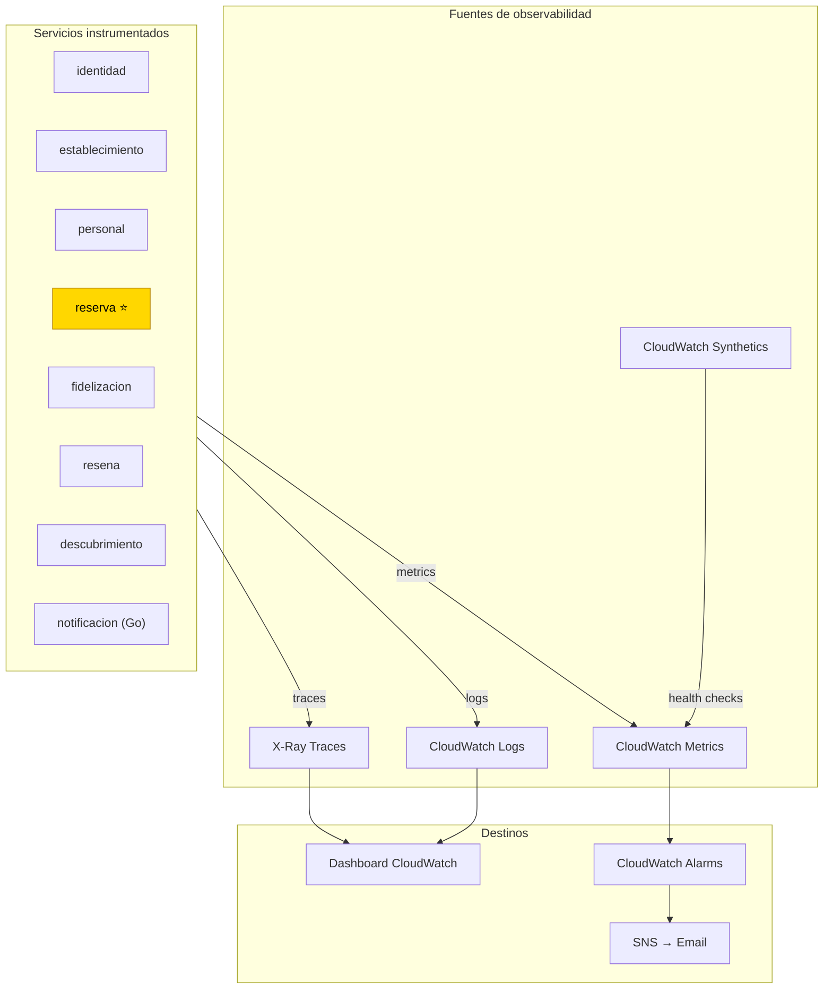

# ADR-007 — Observabilidad Distribuida

- **Estado:** ✅ Aceptada
- **Decisores:** Javier Garcia (Product Owner), Onad (Arquitecto de Software)
- **Fecha:** 2026-08-24
- **ADR Número:** 007

---

## Contexto y Problema

En una arquitectura de microservicios ([ADR-001](ADR-001-adopcion-microservicios.md)), un solo request del cliente puede cruzar 3–5 servicios (API Gateway → identidad → reserva → personal → Kafka → notificacion). Cuando algo falla, no hay un solo log que muestre toda la historia — el problema está fragmentado entre múltiples servicios, múltiples instancias Fargate, múltiples logs.

**Pregunta central:** ¿cómo diagnosticar problemas en un request que cruza 8 servicios desplegados en contenedores Fargate?

**Condición de supervivencia:** Sin observabilidad distribuida, la arquitectura de microservicios es un black box que nadie puede operar ni debuggear.

---

## Drivers de Decisión

- **D1:** El debugging de request cross-service debe ser posible en <10 minutos para un problema conocido
- **D2:** Las alarmas deben detectar problemas antes de que los clientes se den cuenta
- **D3:** El costo de observabilidad debe ser proporcional al volumen real (~$5–10/mes)
- **D4:** La observabilidad no puede degradar el rendimiento de los servicios

---

## Opciones Consideradas

| Área | Opción A | Opción B | Opción C |
|------|----------|----------|----------|
| Tracing distribuido | **AWS X-Ray** | Jaeger auto-hosted | OpenTelemetry + Grafana Cloud |
| Logs centralizados | **CloudWatch Logs** | ELK Stack self-hosted | Grafana Loki |
| Métricas/Alarmas | **CloudWatch Metrics + Alarms** | Prometheus + Grafana | Datadog |
| Monitoreo de endpoints | **CloudWatch Synthetics** (canary) | Pingdom | UptimeRobot |

---

## Decisión

**Opción elegida: AWS X-Ray + CloudWatch (integración nativa, costo mínimo).**

### Tracing distribuido — X-Ray

Cada request que entra por API Gateway genera un **trace ID** único que se propaga automáticamente a todos los servicios que participan.

**Configuración por servicio:**

| Servicio | Tecnología | Instrumentación |
|----------|-----------|-----------------|
| identidad | Java/Spring Boot | `spring-cloud-starter-aws-xray` + `XRayRecorder` |
| establecimiento | Java/Spring Boot | Igual |
| personal | Java/Spring Boot | Igual |
| reserva ⭐ | Java/Spring Boot | Igual |
| fidelizacion | Java/Spring Boot | Igual |
| resena | Java/Spring Boot | Igual |
| descubrimiento | Java/Spring Boot | Igual |
| notificacion | Go | `aws-xray-sdk-go` |

**Sampling rules:**

```yaml
# xray-config.yaml
rules:
  - description: "Errores siempre"
    host: "*"
    http_method: "*"
    url_path: "*"
    fixed_target: 0
    rate: 1.0  # 100%
    reservoir_size: 100
  - description: "Éxitos muestreados"
    host: "*"
    http_method: "*"
    url_path: "*"
    fixed_target: 5
    rate: 0.05  # 5%
    reservoir_size: 100
```

**Resultado:** 100% de requests con error se trazan; 5% de requests exitosos se trazan. Costo controlado.

### Logs centralizados — CloudWatch Logs

Cada servicio escribe a su propio log group:

```
/sillalibre/identidad
/sillalibre/establecimiento
/sillalibre/personal
/sillalibre/reserva
/sillalibre/fidelizacion
/sillalibre/resena
/sillalibre/descubrimiento
/sillalibre/notificacion
```

**Convención de log por servicio:**

```json
{
  "timestamp": "2026-08-24T10:30:00.000Z",
  "level": "INFO",
  "service": "reserva",
  "traceId": "Root=1-64c0f1f1-abcdef1234567890;Parent=1234567890;Sampled=1",
  "operation": "CrearReservaUseCase",
  "message": "Reserva creada exitosamente",
  "reservaId": "RES-001",
  "clienteId": "CLI-42"
}
```

### Métricas y Alarmas — CloudWatch

**Métricas por servicio:**

| Métrica | Umbral de alarma | Acción |
|---------|------------------|--------|
| Error rate > 5% (5 min) | CRÍTICO | SNS → email + dashboard |
| Latencia p95 > 2s (5 min) | WARNING | SNS → email |
| Cola RabbitMQ mensajes > 10 | WARNING | SNS → email |
| DLQ mensajes > 0 | CRÍTICO | SNS → email + dashboard |
| CPU > 70% (10 min) | WARNING | SNS → email |
| Memoria > 80% (10 min) | WARNING | SNS → email |
| RDS connections > 150 | CRÍTICO | SNS → email |
| RDS CPU > 40% (15 min) | WARNING | SNS → email |

**Dashboard CloudWatch:**

```
/sillalibre/dashboard-general
├── Request rate (total y por servicio)
├── Error rate (total y por servicio)
├── Latencia p50/p95/p99
├── Circuit breaker states
├── RabbitMQ queue depths
├── DLQ message count
├── RDS connections + CPU
└── Cost estimate (Fargate hours)
```

### Monitoreo de endpoints — CloudWatch Synthetics

Canary script que ejecuta health checks cada 5 minutos:

```
/sillalibre/canary/reserva-health
→ GET /reserva/health → 200 OK
→ POST /reserva/health (POST inválido) → 400 (no 500)

/sillalibre/canary/identidad-health
→ GET /identidad/health → 200 OK
```

**Alarma:** Canary falla 2 veces consecutivas → CRÍTICO → notificación inmediata.

---

## Consecuencias

### Positivas

- Un request cruzando 5 servicios se debuggea en <10 minutos con un solo trace ID (D1 ✓)
- Los problemas se detectan antes de que los clientes los reporten (D2 ✓)
- Costo total de observabilidad: ~$5–10/mes (D3 ✓)
- CloudWatch + X-Ray son servicios managed — cero mantenimiento de infraestructura de observabilidad

### Negativas

- X-Ray tiene menos features que Jaeger o Tempo (mitigado: suficiente para el volumen actual)
- CloudWatch queries son menos potentes que KQL de Azure o SPL de Splunk (aceptado: volumen manejable)
- Vendor lock-in en formato de traces y logs (mitigado: OpenTelemetry como capa de abstracción futura)

---

## Diagrama



---

## Validación

- [ ] X-Ray habilitado en todos los servicios Java via `spring-cloud-starter-aws-xray`
- [ ] X-Ray habilitado en notificacion (Go) via `aws-xray-sdk-go`
- [ ] Sampling rules configuradas (100% errores, 5% éxitos)
- [ ] Cada servicio escribe logs con `traceId` para correlación
- [ ] Alarmas configuradas para todas las métricas listadas
- [ ] Dashboard CloudWatch creado con métricas de todos los servicios
- [ ] Canary Synthetics ejecutando health checks cada 5 minutos
- [ ] SNS topic configurado con email de notificación del equipo

---

## ADRs Relacionados

- [ADR-001 — Adopción de Microservicios](ADR-001-adopcion-microservicios.md)
- [ADR-003 — Plataforma Cloud AWS](ADR-003-plataforma-cloud-aws.md)
- [ADR-006 — Tolerancia a Fallos](ADR-006-tolerancia-fallos.md)

---

✅ Revisado por Javier Garcia
