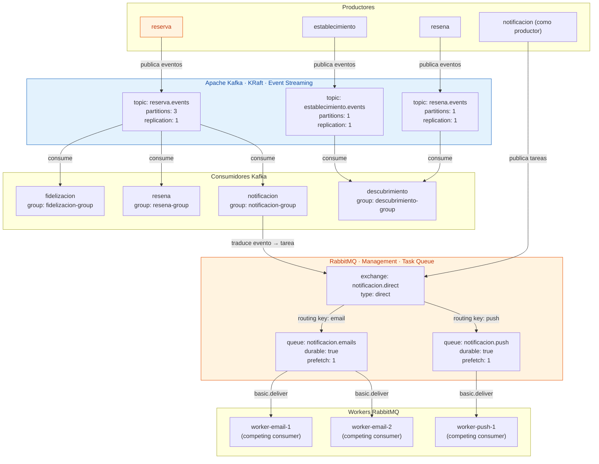
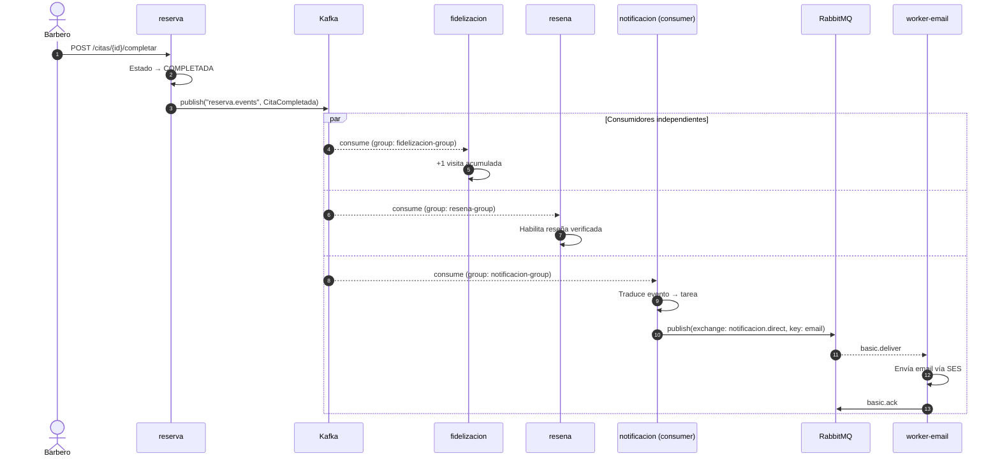
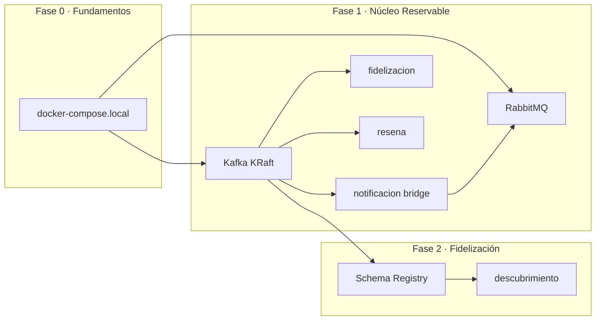

# ADR-008 — Estrategia de Mensajería Híbrida: Kafka + RabbitMQ

- **Estado:** ✅ Aceptada
- **Decisores:** Javier Garcia (Product Owner), Onad (Arquitecto de Software)
- **Fecha:** 2026-08-25
- **ADR Número:** 008
- **ADR Reemplazado:** EventBridge + SQS (previsto en ADR-003, nunca implementado)

---

## Contexto y Problema

La arquitectura de microservicios ([ADR-001](ADR-001-adopcion-microservicios.md)) requiere mensajería asíncrona para dos patrones fundamentalmente diferentes:

1. **Event Streaming** — "Algo pasó en el dominio y múltiples consumidores necesitan reaccionar de forma independiente" (CitaCompletada → fidelizacion + resena + notificacion)
2. **Task Queue** — "Hay un trabajo concreto que un worker debe ejecutar una vez" (enviar email, enviar push, enviar SMS)

El diseño original (ADR-003) proponía **EventBridge + SQS** como solución unificada. Sin embargo, el driver primario del proyecto es **aprendizaje y portafolio profesional** ([ADR-001](ADR-001-adopcion-microservicios.md) §Drivers). Apache Kafka es el estándar de facto de la industria para event streaming y su conocimiento es altamente transferible al mercado laboral. RabbitMQ complementa con task queues, un paradigma que Kafka no resuelve de forma idiomática.

---

## Drivers de Decisión

- **D1 (Primario):** El proyecto es portafolio y herramienta de aprendizaje — la tecnología elegida debe enseñar patrones transferibles al mercado laboral
- **D2:** Kafka es el estándar de facto para event streaming en la industria (LinkedIn, Uber, Netflix, Spotify, Airbnb)
- **D3:** El equipo conoce RabbitMQ básico — refuerza conocimiento existente en task queues
- **D4:** Ejecución 100% local vía Docker Compose — el costo cloud no es factor de decisión
- **D5:** Separación clara de responsabilidades: streaming (eventos de dominio) vs. queuing (tareas de trabajo)
- **D6:** Evitar over-engineering: no todos los mensajes necesitan las garantías de Kafka

---

## Opciones Consideradas

| Opción | Descripción | Paradigma |
|--------|-------------|-----------|
| **A. EventBridge + SQS** (original) | Serverless event bus + colas SQS | Cloud-native, serverless |
| **B. Solo Kafka** | Kafka como broker único para todo | Event streaming unificado |
| **C. Solo RabbitMQ** | RabbitMQ como broker único para todo | Message broker tradicional |
| **D. Híbrido: Kafka + RabbitMQ** *(elegida)* | Kafka para eventos de dominio; RabbitMQ para tareas de trabajo | Streaming + queuing |
| **E. Híbrido: Kafka + SQS** | Kafka para eventos; SQS para tareas | Streaming + serverless queuing |

---

## Decisión

**Opción elegida: D — Kafka (KRaft) + RabbitMQ**

### Separación de responsabilidades

| Componente | Teknología | Responsabilidad | Ejemplos en SillaLibre |
|------------|-----------|-----------------|----------------------|
| **Event Streaming** | Apache Kafka (KRaft mode) | Eventos de dominio inmutables, múltiples consumidores independientes, ordered processing, replay histórico | `CitaCompletada`, `ReservaCreada`, `CitaCancelada`, `NegocioPublicado`, `RatingActualizado` |
| **Task Queue** | RabbitMQ (management) | Tareas de trabajo distribuidas a workers, competing consumers, dead letter handling, prioridad | Enviar email (SES), enviar push (SNS), enviar SMS (futuro) |

### Arquitectura de mensajería



### Configuración Kafka

| Parámetro | Valor | Justificación |
|-----------|-------|---------------|
| **Modo** | KRaft (sin ZooKeeper) | Kafka moderno; ZooKeeper deprecated desde Kafka 3.3 |
| **Brokers** | 1 (desarrollo) / 3 (producción) | Single-node para aprendizaje; multi-node para HA en producción |
| **Particiones por topic** | 3 (reserva.events) / 1 (demás) | Reserva es el topic de mayor volumen; el resto es bajo tráfico |
| **Replication factor** | 1 (desarrollo) / 3 (producción) | Sin replicas en local; HA en producción |
| **Retention** | 7 días (desarrollo) / 30 días (producción) | Replay accesible sin storage excesivo |
| **Cleanup policy** | delete (eventos) | Los eventos se archivan, no se compactan (no son snapshot states) |

**Topics de dominio:**

| Topic | Productor | Consumidores | Particiones | Retención |
|-------|-----------|-------------|-------------|-----------|
| `reserva.events` | reserva | fidelizacion, resena, notificacion, descubrimiento | 3 | 7d / 30d |
| `establecimiento.events` | establecimiento | descubrimiento | 1 | 7d / 30d |
| `resena.events` | resena | descubrimiento | 1 | 7d / 30d |

### Configuración RabbitMQ

| Parámetro | Valor | Justificación |
|-----------|-------|---------------|
| **Exchange** | `notificacion.direct` (type: direct) | Routing por routing key: `email`, `push`, `sms` |
| **Colas** | `notificacion.emails`, `notificacion.push` | Durable, sobreviven reinicio del broker |
| **Prefetch** | 1 por worker | Un worker processa 1 tarea a la vez (competing consumers) |
| **Dead Letter Exchange** | `notificacion.dlx` → queue `notificacion.dlq` | Tareas fallidas 3 veces van a DLQ |
| **ACK manual** | Obligatorio | El worker confirma éxito con `basic.ack`; fallo con `basic.nack` → requeue o DLQ |
| **Management plugin** | Habilitado | Dashboard en localhost:15672 (user: guest / pass: guest) |

**Colas de trabajo:**

| Cola | Exchange | Routing Key | Workers | Propósito |
|------|----------|-------------|---------|-----------|
| `notificacion.emails` | notificacion.direct | email | 2 (competing) | Envío de emails vía SES |
| `notificacion.push` | notificacion.direct | push | 1 | Envío de push vía SNS |
| `notificacion.dlq` | notificacion.dlx | * | 0 (manual) | Auditoría de tareas fallidas |

### Flujo completo: CitaCompletada



### Stack de tecnología local (Docker Compose)

```yaml
services:
  kafka:
    image: confluentinc/cp-kafka:8.3.1
    container_name: sillalibre-kafka
    environment:
      KAFKA_NODE_ID: 1
      KAFKA_PROCESS_ROLES: broker,controller
      KAFKA_CONTROLLER_QUORUM_VOTERS: 1@kafka:9093
      KAFKA_LISTENERS: PLAINTEXT://0.0.0.0:9092,CONTROLLER://0.0.0.0:9093
      KAFKA_ADVERTISED_LISTENERS: PLAINTEXT://kafka:9092
      KAFKA_CONTROLLER_LISTENER_NAMES: CONTROLLER
      KAFKA_INTER_BROKER_LISTENER_NAME: PLAINTEXT
      KAFKA_LOG_RETENTION_HOURS: 168  # 7 días
      CLUSTER_ID: "MkU3OEVBNTcwNTJENDM2Qk"
    ports:
      - "9092:9092"
    volumes:
      - kafka-data:/var/lib/kafka/data

  rabbitmq:
    image: rabbitmq:3.13-management
    container_name: sillalibre-rabbitmq
    ports:
      - "5672:5672"
      - "15672:15672"
    environment:
      RABBITMQ_DEFAULT_USER: guest
      RABBITMQ_DEFAULT_PASS: guest
    volumes:
      - rabbitmq-data:/var/lib/rabbitmq

  kafka-ui:
    image: provectuslabs/kafka-ui:latest
    container_name: sillalibre-kafka-ui
    ports:
      - "8080:8080"
    environment:
      KAFKA_CLUSTERS_0_NAME: sillalibre
      KAFKA_CLUSTERS_0_BOOTSTRAPSERVERS: kafka:9092

volumes:
  kafka-data:
  rabbitmq-data:
```

### Dependencias de infraestructura

```
Sprint 0 (ENA-0-05 · entorno local):
├── docker-compose.yml
│   ├── PostgreSQL (BDs lógicas por servicio)
│   ├── Kafka (KRaft mode)          ← NUEVO
│   ├── RabbitMQ (management)       ← NUEVO
│   └── Kafka UI (visualización)
│
Sprint 1 (Fase 1):
├──.notificacion/consume de Kafka  → publica tareas a RabbitMQ
├── fidelizacion consume de Kafka
├── resena consume de Kafka
└── descubrimiento consume de Kafka + establecimiento
```

---

## Consecuencias

### Positivas

- **Aprendizaje de alto valor:** Kafka enseña event streaming, el paradigma dominante de la industria para sistemas distribuidos
- **Separación clara de paradigmas:** streaming (eventos inmutables, ordered, replay) vs. queuing (tareas, competing consumers, retry)
- **Transferibilidad laboral:** Kafka es el #1 en demanda para roles de data engineering y backend distribuido
- **RabbitMQ complementa:** task queues con management dashboard visual, ideal para aprender competing consumers y dead letter handling
- **Docker local completo:** Kafka + RabbitMQ + UI corriendo con `docker compose up` en <2 minutos
- **Fase 2 preparada:** Schema Registry (Confluent) se agrega sin cambiar la arquitectura

### Negativas

- **Dos brokers = dos mentalidades:** el equipo debe entender dos paradigmas diferentes (mitigado: la separación de responsabilidades es clara)
- **Más infraestructura local:** 3 contenedores extra (Kafka, RabbitMQ, Kafka UI) — ~500MB RAM adicional (aceptable)
- **Complejidad de notificacion:** este servicio consume de Kafka Y publica a RabbitMQ — es el "bridge" entre los dos paradigmas (aceptado: es un patrón real de la industria)
- **Kafka requiere understanding de particiones:** concepto nuevo que no existe en SQS/RabbitMQ (aceptado: es parte del aprendizaje)

---

## Diagrama de Dependencias



---

## Validación

- [ ] Kafka levanta en KRaft mode con `docker compose up kafka` y acepta produc/consumir en <2 minutos
- [ ] RabbitMQ management UI accesible en `localhost:15672` con credenciales guest/guest
- [ ] Kafka UI accesible en `localhost:8080` mostrando topics y consumer groups
- [ ] Test E2E: productor publica `CitaCompletada` en Kafka → 3 consumidores reciben el evento independientemente
- [ ] Test E2E: notificacion consume de Kafka, publica a RabbitMQ, worker recibe y procesa la tarea
- [ ] Test de DLQ: worker falla 3 veces → tarea llega a `notificacion.dlq`
- [ ] Test de competing consumers: 2 workers de email procesan tareas en paralelo (round-robin)

---

## ADRs Relacionados

- [ADR-001 — Adopción de Microservicios](ADR-001-adopcion-microservicios.md)
- [ADR-003 — Plataforma Cloud AWS](ADR-003-plataforma-cloud-aws.md) *(requiere actualización: EventBridge+SQS → Kafka+RabbitMQ)*
- [ADR-006 — Tolerancia a Fallos](ADR-006-tolerancia-fallos.md) *(requiere actualización: SQS → RabbitMQ DLQ)*

---

## Próximos Pasos

> ~~1. Actualizar ADR-003 con la nueva estrategia de mensajería~~ ✅ Completado
> ~~2. Actualizar ADR-006 con patrones de tolerancia a fallos para Kafka y RabbitMQ~~ ✅ Completado

3. Crear docker-compose.local con Kafka KRaft + RabbitMQ + Kafka UI
4. Implementar servicio patrón notificacion como bridge Kafka→RabbitMQ en Fase 1

---

✅ Revisado por Javier Garcia
