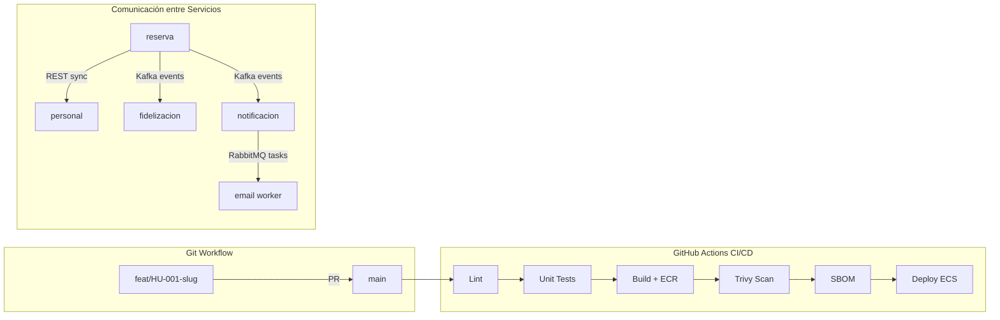

# ADR-009 — Estrategia Git, CI/CD y Protocolos de Comunicación

- **Estado:** ✅ Aceptada
- **Decisores:** Javier Garcia (Product Owner), Onad (Arquitecto de Software)
- **Fecha:** 2026-09-02
- **ADR Número:** 009

---

## Contexto y Problema

Los 8 microservicios ([ADR-001](ADR-001-adopcion-microservicios.md)) requieren convenciones统一 de branching, automatización de integración/despliegue y protocolos de comunicación claros. Con 2 personas y múltiples servicios, la ausencia de estándar genera caos operativo: ramas de larga vida, deploys manuales, comunicación inconsistente entre servicios.

---

## Drivers de Decisión

- **D1:** Velocidad de iteración — equipo de 2 no puede mantener flujos complejos de branching
- **D2:** Seguridad — pipeline debe bloquear vulnerabilidades antes de llegar a producción
- **D3:** Consistencia — todos los servicios deben seguir el mismo patrón de comunicación
- **D4:** Aprendizaje — prácticas industriales transferibles (trunk-based, OIDC, contract testing)

---

## Opciones Consideradas

| Área | Opción A | Opción B | Opción C |
|------|----------|----------|----------|
| Branching | **Trunk-Based con PR gates** | GitFlow | GitHub Flow |
| CI/CD | **GitHub Actions reusable + OIDC** | GitHub Actions manual | GitLab CI |
| Comunicación síncrona | **REST/JSON** | gRPC | GraphQL |
| Comunicación asíncrona | **Kafka + RabbitMQ** ([ADR-008](ADR-008-mensajeria-hibrida-kafka-rabbitmq.md)) | EventBridge + SQS | SNS directo |

---

## Decisión

### 1. Estrategia de Branching: Trunk-Based con PR Gates

**Convención:** ramas cortas (< 3 días) → PR → `main`

| Convención | Regla |
|------------|-------|
| Nombre de rama | `feat\|fix/HU-<id>-slug` (ej: `feat/HU-001-registrar-negocio`) |
| Commits | Conventional Commits (`feat:`, `fix:`, `chore:`) |
| PR template | Checklist de CAs, descripción del cambio, evidencia de testing |
| Revisión cruzada | Obligatoria (equipo de 2) — sin branch protection nativa en repo privado (plan Free) |
| Ambientes | Workspaces Terraform (`dev`/`prod`), nunca ramas |
| Versión de imagen | SHA de commit — rollback = redeploy del tag anterior |
| Estrategia de despliegue | Rolling update en ECS |

### 2. Pipeline de CI/CD: GitHub Actions Reusable con OIDC

**Workflow reutilizable** (`service-ci.yml`) parametrizado por servicio:

```
┌─────────────┐    ┌──────────────┐    ┌─────────────┐    ┌──────────────┐    ┌─────────────┐
│   Lint      │───▶│ Unit Tests   │───▶│ Build Image │───▶│ Trivy Scan   │───▶│ Deploy ECS  │
│  (Checkstyle│    │ (JUnit 5 +   │    │ (Docker     │    │ (fail on     │    │ (rolling    │
│   + PMD)    │    │  Mockito)    │    │  multi-stage│    │  CRITICAL/   │    │  update)    │
│             │    │              │    │  → ECR)     │    │  HIGH)       │    │             │
└─────────────┘    └──────────────┘    └─────────────┘    └──────────────┘    └─────────────┘
                                            │                                        │
                                            ▼                                        ▼
                                      ┌──────────────┐                        ┌──────────────┐
                                      │ SBOM         │                        │ Health Check │
                                      │ (CycloneDX)  │                        │ + X-Ray      │
                                      └──────────────┘                        └──────────────┘
```

**Elementos obligatorios del pipeline:**

| Etapa | Herramienta | Fail-gate |
|-------|-------------|-----------|
| Lint | Checkstyle + PMD (Java), golangci-lint (Go) | Error |
| Unit Tests | JUnit 5 + Mockito, go test | Coverage < 80% |
| Build | Docker multi-stage → ECR | Error |
| Security Scan | Trivy | CRITICAL o HIGH |
| SBOM | CycloneDX | Generado |
| Contract Test | Spectral lint OpenAPI | Backward-incompatible |
| Deploy | ECS rolling update (dev automático, prod con aprobación) | Health check falla |

**Autenticación:** OIDC federation (cero claves AWS estáticas)

### 3. Protocolos de Comunicación

| Tipo | Protocolo | Uso | Ejemplo |
|------|-----------|-----|---------|
| **Síncrono** | REST/JSON | Consultas que requieren respuesta inmediata | reserva → personal (verificar disponibilidad) |
| **Asíncrono - Eventos** | Kafka KRaft | Eventos de dominio (publicación) | reserva publica `ReservaCreada` → fidelizacion, notificacion consumen |
| **Asíncrono - Tareas** | RabbitMQ | Trabajos en background | notificacion publica tarea → worker envía email |

**Contratos:**

- OpenAPI 3 por servicio (fuente de verdad)
- Spectral lint en pipeline (validación de estilo)
- Backward compatibility check (no romper contratos existentes)

---

## Consecuencias

### Positivas

- Ramas cortas = integración continua real, sin conflictos de merge
- OIDC elimina el secreto más grande del stack (claves de larga vida)
- Trivy bloquea vulnerabilidades antes de llegar a ECR
- Contratos OpenAPI versionados evitan roturas entre servicios

### Negativas

- Sin branch protection nativo (repo privado Free) — la revisión se aplica por convención
- 8 pipelines paralelos = costo computacional CI (mitigado: GitHub free tier generoso)
- Contract testing agrega complejidad inicial al pipeline

---

## Diagrama



---

## Validación

- [ ] Pipeline patrón despliega un servicio E2E con health check OK
- [ ] Trivy scan falla intencionalmente con imagen vulnerable (prueba de fail-gate)
- [ ] OIDC federation funciona sin Access Keys estáticas
- [ ] Contract test rechaza cambio rompiente en OpenAPI
- [ ] Comunicación reserva → personal funciona con circuit breaker (ADR-006)

---

## ADRs Relacionados

- [ADR-001 — Adopción de Microservicios](ADR-001-adopcion-microservicios.md)
- [ADR-002 — Stack Poliglota Acotado](ADR-002-stack-poliglota-acotado.md)
- [ADR-003 — Plataforma Cloud AWS](ADR-003-plataforma-cloud-aws.md)
- [ADR-006 — Tolerancia a Fallos](ADR-006-tolerancia-fallos.md)
- [ADR-008 — Mensajería Híbrida Kafka+RabbitMQ](ADR-008-mensajeria-hibrida-kafka-rabbitmq.md)

---

✅ Revisado por Javier Garcia