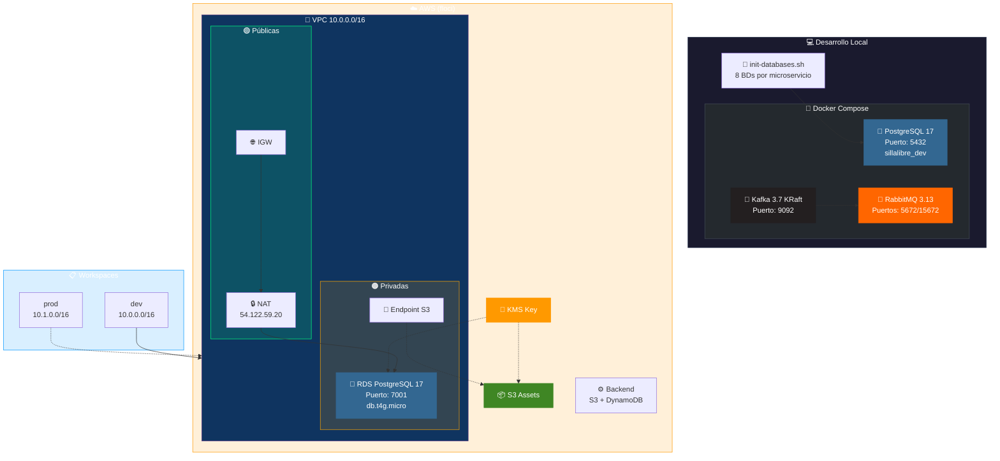
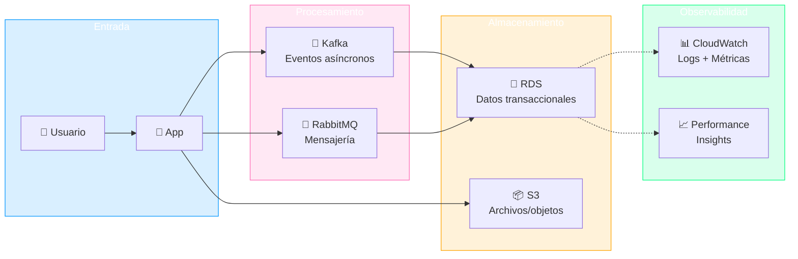
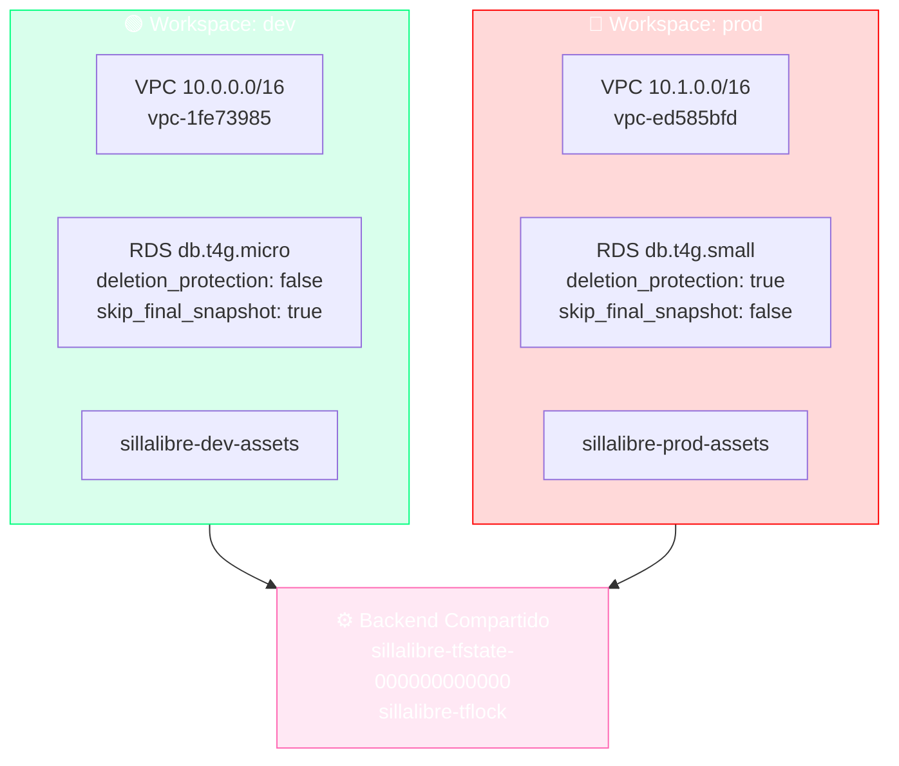

# Arquitectura Completa - SillaLibre

## Diagrama de Alto Nivel

```mermaid
graph TB
    subgraph LOCAL["💻 Desarrollo Local"]
        subgraph DOCKER["🐳 Docker Compose"]
            PG["🐘 PostgreSQL 17<br/>Puerto: 5432<br/>sillalibre_dev"]
            KAFKA["📨 Kafka 3.7 KRaft<br/>Puerto: 9092"]
            RMQ["🐰 RabbitMQ 3.13<br/>Puertos: 5672/15672"]
        end
        SCRIPT["📜 init-databases.sh<br/>8 BDs por microservicio"]
    end

    subgraph AWS["☁️ AWS (floci)"]
        subgraph VPC["🔴 VPC 10.0.0.0/16"]
            subgraph PUBLIC["🟢 Públicas"]
                IGW["🌐 IGW"]
                NAT["🔒 NAT<br/>54.122.59.20"]
            end
            subgraph PRIVATE["🟠 Privadas"]
                RDS["🐘 RDS PostgreSQL 17<br/>Puerto: 7001<br/>db.t4g.micro"]
                VPCE["🔗 Endpoint S3"]
            end
        end
        KMS["🔐 KMS Key"]
        S3["📦 S3 Assets"]
        BACKEND["⚙️ Backend<br/>S3 + DynamoDB"]
    end

    subgraph WORKSPACES["📋 Workspaces"]
        DEV["dev<br/>10.0.0.0/16"]
        PROD["prod<br/>10.1.0.0/16"]
    end

    %% Conexiones
    SCRIPT --> PG
    KAFKA --> RMQ
    IGW --> NAT
    NAT --> RDS
    KMS -.-> RDS
    KMS -.-> S3
    VPCE -.-> S3
    DEV --> VPC
    PROD -.-> VPC

    %% Estilos
    style LOCAL fill:#1a1a2e,stroke:#16213e,color:#fff
    style DOCKER fill:#24292e,stroke:#444d56,color:#fff
    style AWS fill:#FF990026,stroke:#FF9900,color:#fff
    style VPC fill:#0f3460,stroke:#533483,color:#fff
    style PUBLIC fill:#00FF7F26,stroke:#00FF7F,color:#fff
    style PRIVATE fill:#FFA50026,stroke:#FFA500,color:#fff
    style WORKSPACES fill:#0096FF26,stroke:#0096FF,color:#fff
    style RDS fill:#336791,stroke:#336791,color:#fff
    style KMS fill:#FF9900,stroke:#FF9900,color:#fff
    style S3 fill:#3F8624,stroke:#3F8624,color:#fff
    style PG fill:#336791,stroke:#336791,color:#fff
    style KAFKA fill:#231F20,stroke:#231F20,color:#fff
    style RMQ fill:#FF6600,stroke:#FF6600,color:#fff
```

## Flujo de Datos

```mermaid
flowchart LR
    subgraph INGRESS["Entrada"]
        USER["👤 Usuario"]
        APP["📱 App"]
    end

    subgraph PROCESSING["Procesamiento"]
        KAFKA["📨 Kafka<br/>Eventos asíncronos"]
        RMQ["🐰 RabbitMQ<br/>Mensajería"]
    end

    subgraph STORAGE["Almacenamiento"]
        RDS["🐘 RDS<br/>Datos transaccionales"]
        S3["📦 S3<br/>Archivos/objetos"]
    end

    subgraph MONITORING["Observabilidad"]
        CW["📊 CloudWatch<br/>Logs + Métricas"]
        PI["📈 Performance<br/>Insights"]
    end

    USER --> APP
    APP --> KAFKA
    APP --> RMQ
    KAFKA --> RDS
    RMQ --> RDS
    APP --> S3
    RDS -.-> CW
    RDS -.-> PI

    style INGRESS fill:#0096FF26,stroke:#0096FF,color:#fff
    style PROCESSING fill:#FF69B426,stroke:#FF69B4,color:#fff
    style STORAGE fill:#FFA50026,stroke:#FFA500,color:#fff
    style MONITORING fill:#00FF7F26,stroke:#00FF7F,color:#fff
```

## Workspaces - Separación de Entornos

```mermaid
graph TB
    subgraph DEV["🟢 Workspace: dev"]
        VPC_D["VPC 10.0.0.0/16<br/>vpc-1fe73985"]
        RDS_D["RDS db.t4g.micro<br/>deletion_protection: false<br/>skip_final_snapshot: true"]
        S3_D["sillalibre-dev-assets"]
    end

    subgraph PROD["🔴 Workspace: prod"]
        VPC_P["VPC 10.1.0.0/16<br/>vpc-ed585bfd"]
        RDS_P["RDS db.t4g.small<br/>deletion_protection: true<br/>skip_final_snapshot: false"]
        S3_P["sillalibre-prod-assets"]
    end

    BACKEND["⚙️ Backend Compartido<br/>sillalibre-tfstate-000000000000<br/>sillalibre-tflock"]

    DEV --> BACKEND
    PROD --> BACKEND

    style DEV fill:#00FF7F26,stroke:#00FF7F,color:#fff
    style PROD fill:#FF000026,stroke:#FF0000,color:#fff
    style BACKEND fill:#FF69B426,stroke:#FF69B4,color:#fff
```
