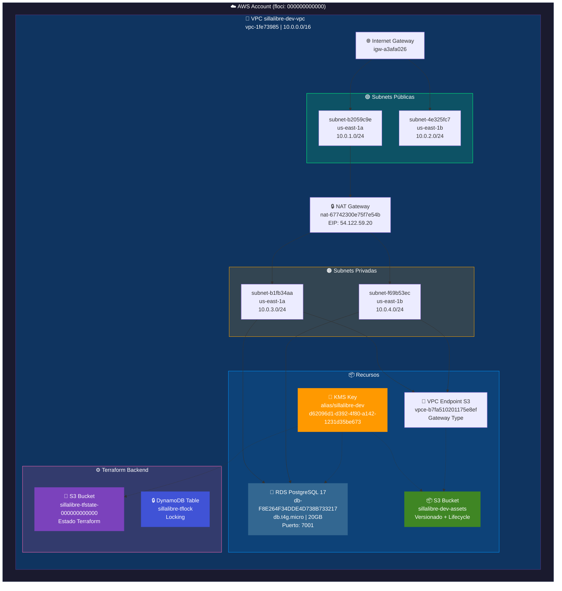

# Arquitectura AWS (floci) - HU-ENA-0-02

## Diagrama de Infraestructura

## Resource Summary

| Componente | Recurso | ID | Valor |
|------------|---------|-----|-------|
| **VPC** | aws_vpc | vpc-1fe73985 | 10.0.0.0/16 |
| **Subnet Pública 1** | aws_subnet | subnet-b2059c9e | 10.0.1.0/24 (us-east-1a) |
| **Subnet Pública 2** | aws_subnet | subnet-4e325fc7 | 10.0.2.0/24 (us-east-1b) |
| **Subnet Privada 1** | aws_subnet | subnet-b1fb34aa | 10.0.3.0/24 (us-east-1a) |
| **Subnet Privada 2** | aws_subnet | subnet-f69b53ec | 10.0.4.0/24 (us-east-1b) |
| **Internet Gateway** | aws_internet_gateway | igw-a3afa026 | — |
| **NAT Gateway** | aws_nat_gateway | nat-67742300e75f7e54b | EIP: 54.122.59.20 |
| **RDS PostgreSQL** | aws_db_instance | db-F8E264F34DDE4D738B733217 | db.t4g.micro, 20GB, puerto 7001 |
| **KMS Key** | aws_kms_key | d62096d1-d392-4f80-a142-1231d35be673 | alias/sillalibre-dev |
| **S3 Assets** | aws_s3_bucket | sillalibre-dev-assets | Versionado + Lifecycle |
| **VPC Endpoint S3** | aws_vpc_endpoint | vpce-b7fa510201175e8ef | Gateway |
| **S3 Backend** | aws_s3_bucket | sillalibre-tfstate-000000000000 | Estado Terraform |
| **DynamoDB Lock** | aws_dynamodb_table | sillalibre-tflock | LockID partition key |
