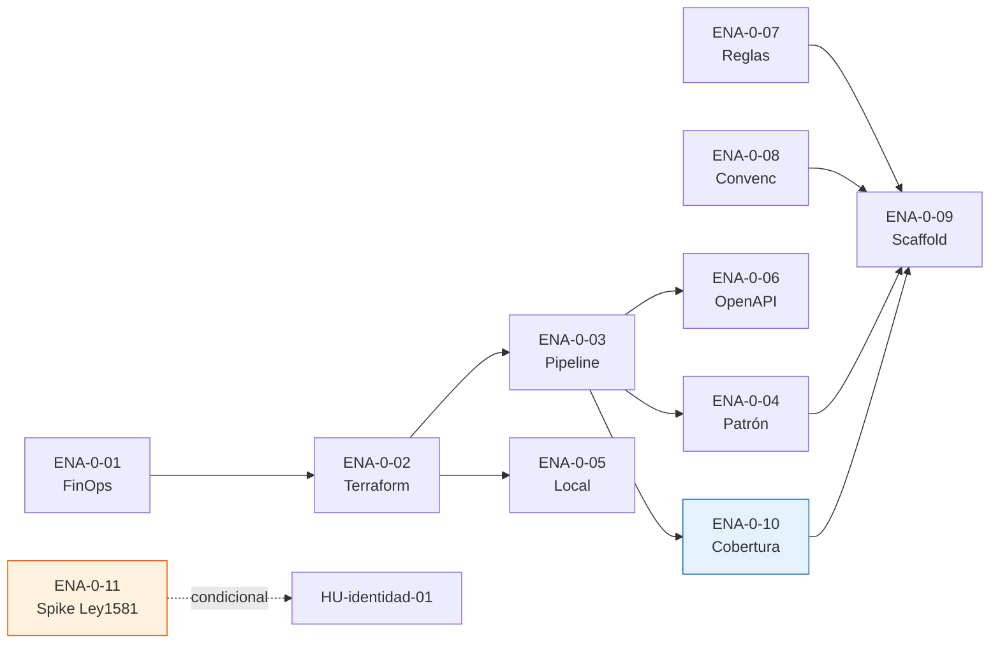

# Matriz de Dependencias — SillaLibre (app-barber)

| Campo | Valor |
|---|---|
| **Fecha** | 2026-09-02 |
| **Versión** | 1.1 |
| **Estado** | ✅ Vigente — incluye ENA-0-10 y ENA-0-11 |

---

## 1. Dependencias Enablers → Enablers



| Enabler | Requiere (bloqueado por) | Sprint |
|---|---|---|
| ENA-0-01 | — | S0-A |
| ENA-0-02 | ENA-0-01 | S0-B |
| ENA-0-03 | ENA-0-02 | S0-B |
| ENA-0-04 | ENA-0-03 | S0-B |
| ENA-0-05 | ENA-0-02 | S0-B |
| ENA-0-06 | ENA-0-03 | S0-B |
| ENA-0-07 | — | S0-A |
| ENA-0-08 | — | S0-A |
| ENA-0-09 | ENA-0-03, ENA-0-04, ENA-0-07, ENA-0-08, **ENA-0-10** | S0-B/C |
| **ENA-0-10** | **ENA-0-03** | **S0-B** |
| **ENA-0-11** | **—** | **S0-A** |

---

## 2. Dependencias Enablers → HUs de Negocio

| HU de Negocio | Enabler Bloqueante | Tipo |
|---|---|---|
| HU-identidad-01 | ENA-0-09 (scaffold identidad) | Hard |
| HU-identidad-01 | ENA-0-07 (reglas arquitectónicas) | Hard |
| HU-identidad-01 | ENA-0-08 (convenciones) | Hard |
| HU-identidad-01 | **ENA-0-11 (spike Ley 1581)** | **Condicional** |
| HU-identidad-02 | ENA-0-09 | Hard |
| HU-E1-01 | ENA-0-09 (scaffold establecimiento) | Hard |
| HU-E2-01 | ENA-0-09 (scaffold personal) | Hard |
| HU-E4-01 | ENA-0-09 (scaffold reserva) | Hard |
| HU-E5-01 | ENA-0-09 (scaffold notificacion) | Hard |
| HU-E6-01 | ENA-0-09 (scaffold fidelizacion) | Hard |
| HU-E7-01 | ENA-0-09 (scaffold resena) | Hard |
| HU-E3-01 | ENA-0-09 (scaffold descubrimiento) | Hard |

---

## 3. Dependencias HUs → HUs (flujo de valor)

| HU | Requiere | Razón |
|---|---|---|
| HU-E1-02 | HU-E1-01 | Necesita establecimiento creado |
| HU-E1-03 | HU-E1-01 | Necesita establecimiento creado |
| HU-E1-04 | HU-E1-01 | Necesita establecimiento creado |
| HU-E2-01 | HU-E1-01 | Necesita establecimiento para invitar barberos |
| HU-E2-02 | HU-E2-01 | Necesita barbero creado |
| HU-E2-03 | HU-E2-02 | Necesita jornada definida |
| HU-E4-01 | HU-E2-02 | Necesita barbero con jornada para calcular slots |
| HU-E4-02 | HU-E4-01 | Necesita slots disponibles |
| HU-E4-03 | HU-E4-02 | Necesita reserva existente |
| HU-E4-04 | HU-E4-02 | Necesita historial de reservas |
| HU-E4-05 | HU-E4-02 | Necesita reserva activa |
| HU-E5-01 | HU-E4-02 | Consume evento ReservaCreada |
| HU-E5-02 | HU-E4-03 | Consume evento CitaCancelada |
| HU-E6-01 | HU-E4-05 | Configura plantillas que se activan con CitaCompletada |
| HU-E6-02 | HU-E4-05, HU-E6-01 | Consume CitaCompletada + plantilla activa |
| HU-E6-03 | HU-E6-02 | Necesita visita acumulada |
| HU-E7-01 | HU-E4-05 | Consume CitaCompletada para habilitar reseña |
| HU-E7-02 | HU-E7-01 | Necesita reseña creada |
| HU-E3-01 | HU-E1-01 | Necesita negocios publicados para buscar |
| HU-E3-02 | HU-E3-01, HU-E1-01 | Ficha requiere datos del negocio |

---

## 4. Dependencias por Eventos de Dominio

| Productor | Evento | Consumidores | Desde |
|---|---|---|---|
| establecimiento | `NegocioPublicado` | descubrimiento (proyección ficha) | S1 |
| reserva | `ReservaCreada` | notificacion (confirmación) | S3 |
| reserva ⭐ | `CitaCompletada` | fidelizacion (+1 visita), resena (habilita reseña), notificacion | S4 |
| reserva | `CitaCancelada` | notificacion (aviso), liberación de slot | S3/S4 |
| resena | cambio de rating | descubrimiento (rating agregado en ficha) | S6→S7 |
| personal | consulta síncrona `GET slots` | reserva (con Resilience4j timeout+CB) | S3 |

---

## 5. Cuello de Botella Identificado

> **ENA-0-09 (scaffold)** es el único enabler que bloquea TODAS las HUs de negocio. Su cadena de dependencias es:
>
> ```
> ENA-0-07 + ENA-0-08 + ENA-0-03 + ENA-0-04 + ENA-0-10 → ENA-0-09 → TODAS las HUs
> ```
>
> Si ENA-0-09 no cierra en S0-B, activar S0-C (contingencia calendarizada).

---

✅ Revisado por Product Owner Agent
