# 📦 Backlog Inicial y Roadmap — app-barber

| Campo | Valor |
|-------|-------|
| **Proyecto** | SillaLibre *(codename técnico: app-barber)* |
| **Fecha** | 2026-08-23 |
| **Versión** | 1.1 |
| **Estado** | ✅ Vigente — backlog nivel épica + marco de ejecución (cadencia, capacidad, ceremonias) definido |
| **Elaborado por** | Product Owner Agent (`planificar_proyecto`) |
| **Fuentes** | [`vision_producto.md`](vision_producto.md) v2.0 · [ADR-001](ADR/ADR-001-adopcion-microservicios.md) · [ADR-002](ADR/ADR-002-stack-poliglota-acotado.md) · [ADR-003](ADR/ADR-003-plataforma-cloud-aws.md) · [`../arquitectura_aws.md`](../arquitectura_aws.md) v1.0 · [`auditoria_well_architected.md`](auditoria_well_architected.md) v1.0 |

> **Alcance de este documento:** Enablers técnicos del Sprint 0, User Story Map (HUs de negocio por épica) y Roadmap por Sprints con dependencias. Las HUs están en estado **borrador (nivel épica)**: requieren refinamiento SMART/BDD (`refinar_hu`) antes de cumplir el Definition of Ready.

---

## 1. Decisiones de Refinamiento Registradas (R1–R3)

Responden las 3 preguntas clave detectadas en la planificación inicial. Complementan (no modifican) las decisiones estratégicas D1–D6 de la Visión.

| ID | Decisión | Detalle | Impacto en el backlog | Fecha |
|----|----------|---------|----------------------|-------|
| **R1** | **Mercado piloto: Cúcuta, Norte de Santander, Colombia** | Moneda **COP**, idioma español, zona horaria `America/Bogota` (UTC−5, sin DST — simplifica jornadas de STF). No existe región AWS en Colombia: **región de despliegue = us-east-1** (latencia ~60–80ms desde Cúcuta, mejor costo que sa-east-1). Justificación registrada. | Desbloquea ENA-0-01; cierra el pendiente estratégico §13.1 de la Visión; plantillas de cuponera se expresan en COP; densidad urbana de Cúcuta hace viable búsqueda por radio (decidir geohash/S2 en diseño de DSC) | 2026-08-23 |
| **R2** | **Autenticación cliente: doble vía** | Email+password **y** OAuth social (Google como proveedor mínimo viable). Ambos flujos terminan emitiendo el mismo JWT firmado por IAM que consume el autorizador de API Gateway. | Amplía alcance de HU-IAM-01 (Sprint 1): federación OIDC + flujo local de credenciales | 2026-08-23 |
| **R3** | **Política mínima de cancelación: autogestión libre sin sanción** | El cliente cancela por cualquier razón personal (imprevisto, demora, distancia, error) hasta el inicio de la cita, con motivo opcional registrado. Dentro de una **ventana de 2h** previas se marca *cancelación tardía* (métrica operativa, no penalización). El barbero marca **no-show** tras 10 min de gracia. Sin multas ni restricciones en MVP — hipótesis a validar con negocios piloto. | Desbloquea refinamiento de HU-E4-03 (Sprint 3); define carga de eventos hacia NTF (avisos de cancelación) y métrica de no-show para analítica futura | 2026-08-23 |
| **R4** | **Marca: SillaLibre** 🪑 | Nombre elegido por resonancia con el gremio ("¿tiene silla libre?"), neutralidad barbería+belleza y venta del diferencial de disponibilidad en vivo. Tagline: *"Reserva tu silla. Gana tu lugar."* `app-barber` queda como codename técnico (carpeta local, docs históricos). Repo remoto: `sillalibre`. Verificado: sin colisiones de app en reservas; "Fiel" descartado por ecosistema *Cliente Fiel* (BR). Intel: Wilapp ya opera belleza-reservas en Colombia → categoría validada. | README y repo slug renombrados pre-creación del remoto (ventana única). Checklist no bloqueante para retro: dominio `sillalibre.co/.com`, handles IG/TikTok, búsqueda de marca ante la SIC | 2026-08-23 |

> ⚠️ **Requisito derivado de R1:** antes del Sprint 4 (NTF), gestionar salida de sandbox de SES + DKIM/SPF del dominio (hallazgo de deliverability de la auditoría). Los recordatorios que no llegan = no-shows = hipótesis central comprometida.

---

## 2. ⏱️ Marco de Ejecución

> Registrado en la sesión del 2026-08-23. Aplica a todos los sprints del roadmap.

### 2.1 Capacidad y Cadencia

| Parámetro | Valor |
|-----------|-------|
| Equipo | 2 personas |
| Dedicación declarada | 3–5 h/semana por persona → **6–10 h/semana totales** |
| Capacidad por iteración | 12–20 h |
| Cadencia estándar | **Iteraciones fijas de 2 semanas** (lunes → viernes) |
| Excepción única | **Sprint 0 ampliado a 4 semanas**, materializado como dos iteraciones formales (S0-A + S0-B) por su naturaleza de investigación, PoCs y estructura base; contingencia S0-C solo si el DoD no cierra |
| Arranque | **Lunes 2026-08-24** |

**Racional:** el timebox fijo es el guardarrail anti-dispersión (ADR-001, driver D5). Un sprint largo abierto diluye la disciplina; dos iteraciones consecutivas otorgan el plazo extra para fundamentos sin renunciar a demo y corte quincenal.

### 2.2 Calendario Anclado (proyección inicial)

| Iteración | Fechas | Objetivo |
|-----------|--------|----------|
| **S0-A** | lun 24 ago → vie 04 sep 2026 | Gobernanza (ENA-0-07, ENA-0-08) · FinOps (ENA-0-01) · inicio Terraform (ENA-0-02) |
| **S0-B** | lun 07 sep → vie 18 sep 2026 | Cierre de plataforma: ENA-0-02 drills · ENA-0-03 pipeline · ENA-0-04 patrón observado · ENA-0-05 local · ENA-0-06 contratos |
| *S0-C (contingencia)* | 21 sep → 02 oct 2026 | Solo si el DoD del S0 no cierra: ENA-0-09 scaffold + pendientes |
| **Sprint 1** | desde 21 sep (o 05 oct si hubo S0-C) | IAM-01/02 + E1-01 |

### 2.3 Ceremonias Calibradas a Baja Capacidad

Overhead objetivo ≤10% del tiempo (~1 h/semana):

| Ceremonia | Formato | Frecuencia |
|-----------|---------|------------|
| Planning | 30–45 min | Lunes de arranque de iteración |
| Check-in escrito asíncrono | 5 min (*ayer / hoy / bloqueos*) | 2× por semana |
| Refinamiento | 30–45 min o asíncrono con `refinar-hu` | Mitad de iteración |
| Review/Demo E2E | 30 min — **siempre con flujo funcionando, nunca slides** | Viernes de cierre |
| Retro | 30 min | Mensual (cierre de cada par de iteraciones) |

### 2.4 Reglas de Flujo

- **WIP = 1** tarea L/XL por persona simultánea (hasta 2 solo si son S/M). Con 3–5 h/semana, el multitasking es dispersión pura.
- **Estimación por tallas** S/M/L/XL; una XL entra prohibida al sprint — se parte antes de planificar. Tras 3 iteraciones se recalibra con throughput real.
- **Regla de corte:** lo no demostrable E2E el viernes de cierre vuelve al backlog íntegro — nada se arrastra "a medias".
- **Métricas:** throughput por iteración · flujo E2E/mes (métrica contractual ADR-001) · lead time.

### 2.5 Proyección Realista con Capacidad Medida

Hipótesis de esfuerzo para dimensionar expectativas (no son compromisos; se recalibran con datos tras 3 iteraciones):

| Fase | Esfuerzo hipotético | Horizonte @6–10 h/sem |
|------|--------------------:|------------------------|
| F0 · Fundamentos | ~60–90 h | 4–6 semanas (incluye contingencia S0-C) |
| F1 · Núcleo reservable | ~140–170 h | ~4–5 meses |
| F2 · Fidelización | ~60–80 h | ~2 meses |
| F3 · Endurecimiento | ~35–45 h | ~1 mes |
| **MVP completo** | **~300–385 h** | **≈ 9–12 meses calendario** |

Apalancadores para comprimir horizonte (decisión NO urgente; se revisa en retro mensual): (a) aumentar horas semanales, (b) recorte quirúrgico de alcance (ej.: absorber HU-E1-04 en la ficha del negocio, diferir HU-E2-03), (c) aceptar el horizonte largo — el orden del roadmap ya protege el valor temprano.

---

## 3. 🔧 Sprint 0 "Fundamentos" — Enablers Técnicos

Extraídos de: ADR-001 §Guardarrails (Fase 0), criterios de validación de ADR-002/003, Quick Wins de la auditoría Well-Architected y ampliación solicitada por el PO (gobernanza + scaffold).

| ID | Enabler | Alcance | Criterio de Aceptación (medible) | Fuente |
|----|---------|---------|----------------------------------|--------|
| **ENA-0-01** | Decisión de región + FinOps base | ✅ Resuelto por R1 (us-east-1). Presupuesto AWS **forecast-based $96/$160** con notificación SNS→email (corrección sobre el diseño original $50/$120, que era inferior al costo proyectado $125–150); tags cost-allocation por servicio | Alarmas de presupuesto activas **antes** del primer despliegue; presupuesto calibrado sin fatiga de alarmas | ADR-003 §Mitigaciones · Auditoría QW#4, #12 |
| **ENA-0-02** | Terraform base endurecido | VPC+NAT, workspaces dev/prod, RDS PostgreSQL 17 con backups 7d + PITR, KMS, `deletion_protection`, `max_connections=200`; S3 Gateway Endpoint (gratis); módulo EventBridge base (bus vacío; colas por consumidor se crean con cada servicio) | `terraform apply` desde cero + prueba **destroy/recreate** exitosa + **drill de restauración PITR** documentado (RPO≤5min, RTO≤30min) | ADR-003 §Validación · Auditoría #1 🔴 |
| **ENA-0-03** | Pipeline patrón CI/CD | Workflow reutilizable GitHub Actions: **OIDC** (cero claves estáticas) → tests → build → **Trivy fail-gate CRITICAL/HIGH** → SBOM → Dependabot activo → deploy rolling ECS dev (prod con aprobación manual) | El servicio patrón despliega E2E por el pipeline; un PR con hallazgo CRITICAL/HIGH no llega a ECR | ADR-003 §CI/CD · Auditoría #4 🟠 |
| **ENA-0-04** | Monorepo + servicio patrón observado | Estructura monorepo carpeta-por-servicio; servicio patrón Spring Boot right-sized (**0.5 vCPU / 1GB**, `-XX:MaxRAMPercentage=75`, pool HikariCP ≤6); retención logs 30d dev / 90d prod; sampling rules X-Ray | Trace X-Ray visible cruzando **API Gateway → servicio patrón → RDS** | ADR-002 · Auditoría #2, #5, #8 🔴🟠 |
| **ENA-0-05** | Entorno local reproducible | docker-compose: PostgreSQL con script de BDs lógicas por servicio, ElasticMQ; puerto de mensajería dual (in-memory ↔ SQS); regla "lo que corre en local corre igual en AWS — la IaC es la única diferencia" | Un desarrollador nuevo levanta el entorno y ejecuta un flujo local en **<1 día** | `arquitectura_aws` §4 · ADR-001 F0 |
| **ENA-0-06** | Contratos OpenAPI desde el día 1 | Spec OpenAPI 3 versionada por servicio; **spectral lint + chequeo backward-compat** integrados al pipeline patrón | El pipeline rechaza un cambio rompiente sin bump de versión mayor | ADR-002 §Validación · Auditoría #10 |
| **ENA-0-07** | 🆕 Reglas arquitectónicas del proyecto | Ejecutar cuestionario `init-reglas-arquitectonicas` → genera `artifacts/reglas_arquitectonicas.md`: nomenclatura de código, arquitectura interna por servicio (**hexagonal ligera / ports & adapters** como base común), patrones aprobados por servicio, pirámide de testing, manejo de secretos, DoD técnico | Documento publicado y referenciado desde este backlog; todo PR posterior se evalúa contra él | Solicitado por PO · Visión §14.2 |
| **ENA-0-08** | 🆕 Estándares de ingeniería y convenciones | Convención **trunk-based con PR gates** (corrige hallazgo de deploys directos a main): nombres de rama `feat|fix/HU-<id>-slug`, conventional commits, template de PR con checklist de CAs, **revisión cruzada obligatoria** (equipo de 2), ambientes = workspaces Terraform (`dev`/`prod`), versión de imagen = SHA de commit (rollback = redeploy del tag anterior), estrategia rolling + criterios de rollback | Documento de convenciones publicado (puede vivir dentro de `reglas_arquitectonicas.md` §DevOps); primer PR real cumple el flujo completo rama→PR→review→merge→deploy | Solicitado por PO · Auditoría QW (gates) |
| **ENA-0-09** | 🆕 Scaffold base de los 8 microservicios | Esqueleto **template-driven** por servicio: estructura hexagonal (dominio/application/adapters), patrones candidatos declarados — **Outbox transaccional** (RES), **CQRS read-model** (DSC), **consumidor SQS idempotente + manejo DLQ** (CPN, RSN, NTF), **emisor OIDC/JWT** (IAM) — Dockerfile multi-stage (JRE 21 / Go), healthchecks actuator, logs JSON estructurados, X-Ray SDK cableado, stub OpenAPI, wiring al pipeline reutilizable | **Muestreo por representatividad:** despliegan en dev con `/health` OK el patrón Spring + NTF (Go); los 8 restantes compilan, pasan CI y quedan listos para activación (evita pagar 8 tareas Fargate vacías — guardarrail FinOps) | Solicitado por PO · ADR-001 F0 |

### Orden de ejecución interno del Sprint 0

```
Semana 1:  ENA-0-07 (reglas) ─┬─→ ENA-0-08 (convenciones)     [paralelizables]
           ENA-0-01 (FinOps) ─┘
Semana 2+: ENA-0-02 (Terraform) → ENA-0-03 (pipeline) → ENA-0-04 (patrón observado)
           ENA-0-05 (local) y ENA-0-06 (OpenAPI) en paralelo al avance de plataforma
Cierre:    ENA-0-09 (scaffold) ← requiere 03, 04, 07 y 08 estables
```

### Definition of Done del Sprint 0

Plataforma completa levantable/destruible/restaurable con Terraform + 2 imágenes representativas (Java y Go) desplegadas E2E con tracing visible + gobernanza publicada + 8 esqueletos compilando en CI.

> **Nota de capacidad (medida, §2.1):** 9 enablers ≈ 60–90 h frente a una capacidad de 12–20 h por iteración. Por eso el Sprint 0 se ejecuta en **4 semanas (S0-A + S0-B)** con contingencia **S0-C** según calendario de §2.2. La Regla de parada (ADR-001) prohíbe iniciar Sprint 1 sin este DoD completo.

---

## 4. 🗺️ User Story Map — HUs de Negocio

**Backbone (recorrido de valor del usuario):**

```
Alta del Negocio → Configurar Oferta → Descubrir → Reservar → Operar la Cita ⭐ → Notificar → Fidelizar → Reseñar → Administrar Plataforma
```

⭐ **Evento dominante:** `CitaCompletada` alimenta Historial + Cuponera + Reseñas simultáneamente (Visión §7). RES es la joya de la corona del backlog.

### Release F1 · Núcleo Reservable *(IAM + EST + STF + RES + NTF)*

| ID | Historia (Como / Quiero / Para) | Valor de negocio | Servicio | Sprint |
|----|----------------------------------|------------------|----------|--------|
| HU-IAM-01 | Como *cliente*, quiero registrarme e iniciar sesión **con email+password o Google (OAuth)** — R2, para operar de forma segura | Habilita toda interacción bilateral | IAM | S1 |
| HU-IAM-02 | Como *admin*, quiero roles diferenciados (cliente/dueño/barbero/admin), para que cada actor acceda solo a lo suyo (D4) | Base de permisos de todo el sistema | IAM | S1 |
| HU-E1-01 | Como *admin*, quiero dar de alta un establecimiento piloto con su catálogo básico, para sembrar oferta real (D5) | Mitiga huevo-gallina con datos de calidad | EST | S1 |
| HU-E1-02 | Como *dueño*, quiero configurar sedes y horarios, para reflejar mi operación real | Disponibilidad veraz = confianza | EST | S2 |
| HU-E1-03 | Como *dueño*, quiero publicar servicios con precio informativo (**COP**) y duración estimada, para que el cliente compare | Transparencia de oferta | EST | S2 |
| HU-E1-04 | Como *dueño*, quiero indicar métodos de pago aceptados, para evitar fricción al llegar al local | Expectativa clara (la app no mueve dinero, D1) | EST | S2 |
| HU-E2-01 | Como *dueño*, quiero invitar a barberos con cuenta propia, para delegar la operación (D4) | Escala la oferta sin intermediación | STF | S2 |
| HU-E2-02 | Como *barbero*, quiero definir jornadas y especialidades (TZ `America/Bogota`), para que solo me reserven cuando puedo | Agenda realista | STF | S2 |
| HU-E2-03 | Como *barbero*, quiero mostrar disponibilidad en vivo, para capturar demanda espontánea | Diferenciador vs WhatsApp/papel | STF | S3 |
| HU-E4-01 | Como *cliente*, quiero ver slots disponibles combinando horarios del local y jornadas del barbero, para decidir rápido | Corazón de la propuesta de valor | RES | S3 |
| HU-E4-02 | Como *cliente*, quiero reservar (servicio+barbero+horario) y recibir confirmación, para asegurar mi turno | Conversión de la hipótesis central | RES | S3 |
| HU-E4-03 | Como *cliente*, quiero cancelar por cualquier razón hasta el inicio de la cita (R3: autogestión libre, motivo opcional; <2h = tardía; no-show por barbero tras 10 min de gracia), para no perder la libertad personal | Reduce fricción; genera métricas de no-show | RES | S3 |
| HU-E4-04 | Como *cliente*, quiero mi historial de citas por local/barbero ("mi barbero de confianza"), para repetir sin pensar | Retención emocional | RES | S4 |
| HU-E4-05 ⭐ | Como *barbero/dueño*, quiero marcar una cita como completada, para activar historial, cupones y reseña | **Evento dominante `CitaCompletada` alimenta 3 módulos** | RES | S4 |
| HU-E5-01 | Como *cliente*, quiero confirmación y recordatorio automático de mi cita, para no olvidarla | Ataca directamente el no-show | NTF | S4 |
| HU-E5-02 | Como *cliente*, quiero avisos ante cambios/cancelaciones, para reaccionar a tiempo | Confianza en la plataforma | NTF | S4 |

### Release F2 · Fidelización *(CPN + RSN + DSC → MVP completo)*

| ID | Historia | Valor de negocio | Servicio | Sprint |
|----|----------|------------------|----------|--------|
| HU-E6-01 | Como *dueño*, quiero activar **plantillas de fidelización predefinidas** (expresadas en COP), para competir sin complejidad (D3) | **Diferenciador vs Booksy/Fresha** | CPN | S5 |
| HU-E6-02 | Como *cliente*, quiero acumular visitas automáticamente al completarse citas, para ganar recompensas sin esfuerzo | Loop de hábito | CPN | S5 |
| HU-E6-03 | Como *barbero*, quiero validar la redención de una recompensa en local, para cerrar el circuito de fidelización | La fidelización ocurre en el sillón | CPN | S5 |
| HU-E7-01 | Como *cliente*, quiero reseñar solo tras cita completada, para que las opiniones sean creíbles (D6) | Confianza verificada | RSN | S6 |
| HU-E7-02 | Como *admin/moderador*, quiero moderación básica de reseñas, para proteger la calidad del marketplace | Calidad de la señal de rating | RSN | S6 |
| HU-E3-01 | Como *cliente*, quiero buscar negocios por cercanía o preferencia (radio urbano en Cúcuta), para descubrir opciones relevantes | Puerta de entrada del funnel | DSC | S7 |
| HU-E3-02 | Como *cliente*, quiero una ficha pública del negocio (servicios, rating agregado, disponibilidad resumen), para decidir sin llamar | SSR/SEO = adquisición orgánica (Next.js) | DSC | S7 |

### Release F3 · Endurecimiento

| ID | Historia / Trabajo | Valor de negocio | Sprint |
|----|--------------------|------------------|--------|
| HU-E8-01 | Como *admin*, quiero portal de soporte, onboarding asistido y moderación consolidada, para escalar el piloto con calidad de datos (D5) | Operativa fundadora sin SQL manual | S8 |
| Enablers F3 | Alarmas supervivencia completas (DLQ depth >0, 5xx API GW, p95, **canary sintético del flujo reservar cada 5min**), WAF+throttling en edge, autoscaling formal (target tracking CPU 60%; NTF por backlog SQS), contract testing obligatorio en CI, Resilience4j (timeout 2s + circuit breaker RES→STF), política no-show recalibrada con datos del piloto | Supervivencia operativa del marketplace | S8 |

**Regla de slicing aplicada:** cada HU es vertical (incluye su UI en Next.js o Angular, su API y su persistencia). Los frontends no son tareas horizontales separadas: son el canal de entrega de cada slice.

---

## 5. 📅 Roadmap por Sprints y Dependencias

Secuencia bajo la **Regla de parada** (ADR-001): ninguna fase inicia sin la anterior E2E desplegada y estable.

```mermaid
graph LR
    S0["S0 · Fundamentos: gobernanza + plataforma + scaffold"]
    S1["S1 · Identidad y primer negocio"]
    S2["S2 · Oferta operativa"]
    S3["S3 · Reservar núcleo + outbox"]
    S4["S4 · Ciclo completo + NTF en Go"]
    G1{{"GATE · Cierre Fase 1"}}
    S5["S5 · Cuponera"]
    S6["S6 · Reseñas"]
    S7["S7 · Descubrimiento CQRS"]
    G2{{"GATE · MVP funcional"}}
    S8["S8 · Endurecimiento + portal admin"]
    G3{{"GATE · Cierre Fase 3"}}

    S0 --> S1 --> S2 --> S3 --> S4 --> G1 --> S5 --> S6 --> S7 --> G2 --> S8 --> G3

    S1 -.->|"eventos NegocioPublicado"| S7
    S4 -.->|"evento CitaCompletada"| S5
    S4 -.->|"evento CitaCompletada"| S6
    S6 -.->|"rating agregado"| S7

    classDef sprint fill:#0096FF26,stroke:#0096FF,color:#fff
    classDef nucleo fill:#FF69B426,stroke:#FF69B4,color:#fff
    classDef gate fill:#00FF7F26,stroke:#00FF7F,color:#fff

    class S0,S1,S2,S5,S6,S7,S8 sprint
    class S3,S4 nucleo
    class G1,G2,G3 gate
```



| Sprint | Contenido | Criterio de salida (flujo E2E demostrable) |
|--------|-----------|--------------------------------------------|
| **S0-A / S0-B** *(4 semanas, §2.2; contingencia S0-C)* | ENA-0-01…09 | Plataforma apply/destroy/recreate + drill restauración + 2 imágenes representativas trazadas + gobernanza publicada + 8 esqueletos en CI |
| **S1** | IAM-01/02, E1-01 (+shell portal Angular) | Admin crea negocio piloto vía JWT en API Gateway |
| **S2** | E1-02/03/04, E2-01/02 | Oferta completa (sede+horarios+servicios+staff) configurable desde el portal |
| **S3** | E4-01/02/03 + **outbox → EventBridge `ReservaCreada`** | Cliente reserva desde Next.js contra ambiente dev en AWS |
| **S4** | E5-01/02 (**primer PR productivo en Go** — meta ADR-002: dentro de las 2 primeras semanas de Fase 1), E4-04/05 | Flujo *reservar→notificar→completar→historial* E2E + traces X-Ray ≥3 servicios → **Cierre Fase 1** ✅ + check escala de retroceso |
| **S5** | E6-01/02/03 consumiendo `CitaCompletada` vía cola SQS `cpn-citas-completadas` | Visita acumula automáticamente y se redime validada en local |
| **S6** | E7-01/02 consumiendo `CitaCompletada` vía `rsn-citas-completadas` | Reseña verificada post-cita publicada y moderable |
| **S7** | E3-01/02 (proyecciones DynamoDB; ⚠️ decisión geohash/S2 **en diseño, antes de implementar** — Auditoría #11) | Cliente descubre→ficha→reserva sin contacto humano → **Cierre Fase 2 · MVP** ✅ |
| **S8** | E8-01 + hardening de auditoría (WAF/throttling, canary, autoscaling, contract testing, Resilience4j) | Portal admin operativo + alarmas supervivencia activas → **Cierre Fase 3** ✅ |

### Dependencias técnicas clave (mapa de eventos)

| Productor | Evento | Consumidores | Desde |
|-----------|--------|--------------|-------|
| EST | `NegocioPublicado` | DSC (proyección ficha) | disponible desde S1 |
| RES | `ReservaCreada` | NTF (confirmación) | S3 |
| RES ⭐ | `CitaCompletada` | RES-historial · CPN (+1 visita) · RSN (habilita reseña) | S4 |
| RES | `CitaCancelada` | NTF (aviso) · liberación de slot | S3/S4 |
| RSN | cambio de rating | DSC (rating agregado en ficha) | S6→S7 |
| STF | consulta síncrona `GET slots` | RES (con Resilience4j timeout+CB en F3) | S3 |

---

## 6. Estado DoR Global y Próximos Pasos

**Dictamen:** el backlog está **estructurado pero no READY**. Ninguna HU pasa aún el DoR completo: falta refinamiento BDD/SMART, estimación y desglose técnico por slice.

| # | Próximo paso | Herramienta | Cuándo |
|---|--------------|-------------|--------|
| 1 | **Arrancar S0-A** — planning lunes 24-ago: compromiso de iteración = ENA-0-07 + ENA-0-08 + ENA-0-01 | Planning 45 min | lun 2026-08-24 |
| 2 | Configurar reglas arquitectónicas del proyecto (ejecuta ENA-0-07) | `init-reglas-arquitectonicas` | semana 1 de S0-A |
| 3 | Refinar tanda 2: ENA-0-02…09 + HUs de Sprint 1 (IAM-01/02, E1-01) | `refinar-hu` | mitad de S0-A (refinamiento) |
| 4 | Actualizar Visión §9 (gap #5 → tratado por R3) y §13 (pendiente región → cerrado por R1) | edición puntual | backlog de gobernanza |
| 5 | Validar HUs refinadas antes de planificar implementación | `validar-hu` | antes de cada Sprint |

---

## 7. Trazabilidad

| Artefacto de este documento | Origen |
|------------------------------|--------|
| Épicas E1–E8 y evento dominante | Visión §4–§8 |
| Fases verticales S0–S8 y Regla de parada | ADR-001 §Guardarrails |
| Stack por servicio y contratos OpenAPI | ADR-002 |
| Recursos AWS, pipeline, FinOps, entorno local | ADR-003 + `arquitectura_aws.md` §2–§5 |
| Endurecimiento RDS/pipeline/right-sizing/alarmas | Auditoría Well-Architected §3 (Quick Wins) |
| R1–R3 (mercado, auth, cancelaciones) | Sesión de refinamiento PO 2026-08-23 |

---

✅ Revisado por Javier Garcia (Product Owner)
