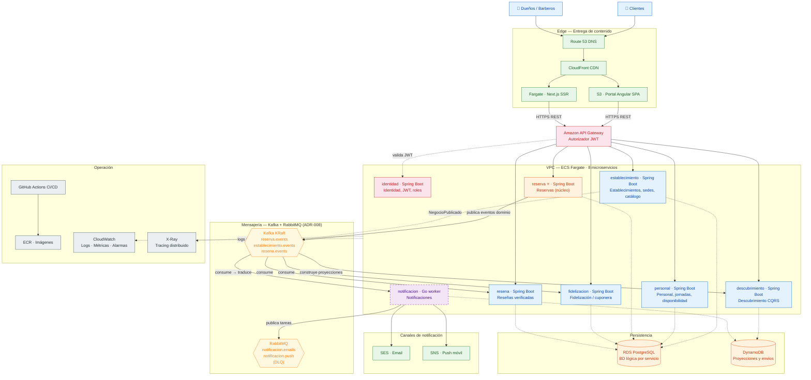
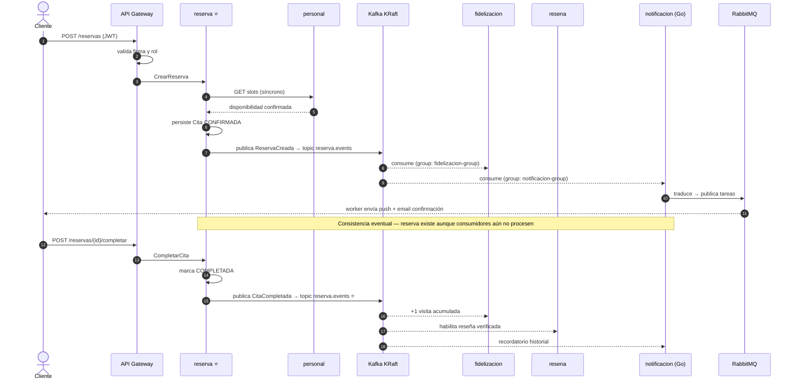

# Blueprint de Arquitectura — SillaLibre (app-barber)

| Campo | Valor |
|-------|-------|
| **Proyecto** | SillaLibre (app-barber) |
| **Fecha** | 2026-09-02 |
| **Versión** | 1.4 |
| **Estado** | ✅ Vigente — consolidación y complemento de decisiones arquitectónicas existentes + sincronización NFRs v2.2 |
| **ADRs origen** | [ADR-001](ADR/ADR-001-adopcion-microservicios.md) · [ADR-002](ADR/ADR-002-stack-poliglota-acotado.md) · [ADR-003](ADR/ADR-003-plataforma-cloud-aws.md) · [ADR-004](ADR/ADR-004-arquitectura-interna-hexagonal.md) · [ADR-005](ADR/ADR-005-persistencia-strategy.md) · [ADR-006](ADR/ADR-006-tolerancia-fallos.md) · [ADR-007](ADR/ADR-007-observabilidad.md) · [ADR-008](ADR/ADR-008-mensajeria-hibrida-kafka-rabbitmq.md) · [ADR-009](ADR/ADR-009-devops-y-comunicacion.md) |
| **Documentos derivados** | [`vision_producto.md`](vision_producto.md) · [`backlog_roadmap.md`](backlog_roadmap.md) · [`auditoria_well_architected.md`](auditoria_well_architected.md) · [`arquitectura_aws.md`](../arquitectura_aws.md) |
| **Elaborado por** | Onad — Arquitecto de Software |

> **Propósito:** Este Blueprint consolida, valida y complementa las decisiones arquitectónicas ya documentadas en los ADRs 001–009, identificando gaps, proporcionando el layout concreto de implementación y proponiendo próximos pasos para Sprint 0.

---

## 1. Resumen Ejecutivo y NFRs Clave

### Tipo de Sistema Identificado
**Microservicios Event-Driven sobre AWS** — Marketplace bilateral con 8 servicios custom (7 dominio + identidad), comunicación síncrona REST para consultas y eventos asíncronos via **Kafka KRaft** (eventos de dominio) + **RabbitMQ** (tareas de trabajo) para propagación de estado — [ADR-008](ADR/ADR-008-mensajeria-hibrida-kafka-rabbitmq.md).

### Atributos Priorizados (orden de impacto) — actualizado v1.3

| Atributo | Prioridad | Justificación |
|----------|-----------|---------------|
| **Mantenibilidad** | 🔴 Máxima | Equipo de 2 personas; el proyecto muere por dispersión, no por complejidad técnica |
| **Costo Controlado** | 🔴 Alta | Proyecto personal piloto; techo $125–150/mes a plena operación |
| **Observabilidad** | 🟠 Alta | Condición de supervivencia de la arquitectura distribuida (X-Ray desde Fase 0) |
| **Resiliencia** | 🟠 Alta | SPOF identificado en RDS compartida; reserva→personal acoplamiento síncrono sin patrones de tolerancia |
| **Escalabilidad** | 🟡 Media | Piloto con 3–5 negocios; escalabilidad real es futura, no actual |
| **Seguridad** | 🟡 Media | JWT/API Gateway cubre auth; WAF y supply chain son mejoras mediano plazo |
| **Cumplimiento Legal** | 🟡 Media | Ley 1581 de 2012 (Colombia) — protección de datos personales |
| **Latencia** | ⚪ Baja | Mercado local Cúcuta (us-east-1); latencia ~60–80ms es aceptable |

### NFRs Cuantificados (derivados de la auditoría WAF + vision_producto v2.2)

| NFR | Meta | Estado Actual |
|-----|------|---------------|
| Disponibilidad servicio reserva | ≥ 99.5% (piloto), 99.95% (producción) | No definido |
| p95 latencia API | < 800ms | No medido |
| RPO (pérdida datos) | ≤ 5 min | No configurado (sin PITR activo) |
| RTO (recuperación) | ≤ 30 min (críticos), < 1h (resto) | No probado |
| Conexiones RDS por servicio | ≤ 6 (HikariCP) | Configurado (ADR-005: pool=6) |
| Retención logs | 30d dev / 90d prod | No definido |
| **Cobertura tests** | **≥ 80% lógica de negocio** | **No medido** |
| **Cumplimiento legal** | **Ley 1581 de 2012 (Colombia)** | **No auditado** |
| **Dispositivos MVP** | **Web responsive únicamente** | **Definido** |

---

## 2. Estilo Arquitectónico Elegido

### Arquitectura: **Microservicios con Bounded Contexts + Event-Driven**

**ADR-001 ya documenta esta decisión.** Validación:

| Factor | Evaluación |
|--------|-----------|
| Fronteras de dominio | ✅ 7 bounded contexts naturales alineados a épicas E1–E7 |
| Objetivo formativo | ✅ Patrones distribuidos reales (mensajería, tracing, IaC) |
| Greenfield sin legado | ✅ Sin restricciones heredadas |
| Equipo | ⚠️ 2 personas — riesgo mitigado por guardarrails y fases verticales |
| Escalado futuro | ✅ Separación física de datos prevista (RDS compartida → instancias separadas) |

### Trade-offs Aceptados (documentados en ADR-001)

**Se sacrifica:**
- Velocidad de iteración inicial (vs. monolito modular)
- Costo operativo (~$125–150/mes vs. ~$30–50 monolito)
- Complejidad de debugging distribuido

**Se gana:**
- Aprendizaje real de patrones industriales transferibles
- Independencia de despliegue por servicio
- Escalado independiente listo para crecimiento real
- Cada servicio como pieza de portafolio profesional

### Validación contra Regla de Decisión

La recomendación original (vision_producto.md §12) era **Monolito Modular** optimizando time-to-market. La re-apertura hacia Microservicios se justificó por el driver D1 (objetivo formativo). **La escala de retroceso está bien definida:** si al cierre de Fase 1 el impuesto operativo bloquea el avance, se consolida progresivamente documentándolo en nuevo ADR.

---

## 3. Diagrama de Comunicación (Mermaid)



### Eventos de Dominio — Flujo del Evento Semilla



---

## 4. Layout Propuesto de Directorios

### Estructura del Monorepo

```
app-barber/                          # Raíz del monorepo
│
├── artifacts/                       # Documentación de producto y ADRs
│   ├── vision_producto.md
│   ├── backlog_roadmap.md
│   ├── auditoria_well_architected.md
│   ├── blueprint_arquitectura.md    # Este documento
│   ├── reglas_arquitectonicas.md    # ← ENA-0-07 (pendiente)
│   ├── convenciones.md              # ← ENA-0-08 (pendiente)
│   ├── ADR/
│   │   ├── ADR-001-adopcion-microservicios.md
│   │   ├── ADR-002-stack-poliglota-acotado.md
│   │   ├── ADR-003-plataforma-cloud-aws.md
│   │   ├── ADR-004-arquitectura-interna-hexagonal.md
│   │   ├── ADR-005-persistencia-strategy.md
│   │   ├── ADR-006-tolerancia-fallos.md
│   │   └── ADR-007-observabilidad.md
│   └── HU/                          # Generado por skills agénticas
│       ├── HU-identidad-01/
│       │   ├── HU.md
│       │   ├── Refinamiento.md
│       │   ├── Plan.md
│       │   └── Tracking.md
│       └── .../
│
├── services/                        # 8 microservicios
│   ├── identidad/                   # Identidad, JWT, roles [Java 21 / Spring Boot 3]
│   │   ├── pom.xml
│   │   ├── Dockerfile               # Multi-stage: build → JRE 21 slim
│   │   ├── src/
│   │   │   └── main/
│   │   │       ├── java/com/sillalibre/identidad/
│   │   │       │   ├── domain/          # Entidades, Value Objects, puertos
│   │   │       │   │   ├── model/
│   │   │       │   │   └── port/
│   │   │       │   │       ├── inbound/
│   │   │       │   │       └── outbound/
│   │   │       │   ├── application/     # Casos de uso
│   │   │       │   ├── adapters/        # REST controllers, JPA repos, JWT provider
│   │   │       │   │   ├── inbound/rest/
│   │   │       │   │   └── outbound/
│   │   │       │   └── IdentidadApplication.java
│   │   │       └── resources/
│   │   │           ├── application.yml
│   │   │           ├── application-dev.yml
│   │   │           └── openapi.yaml
│   │   └── src/test/
│   │       ├── java/com/sillalibre/identidad/
│   │       │   ├── unit/
│   │       │   └── integration/
│   │       └── resources/
│   │           └── application-test.yml
│   │
│   ├── establecimiento/             # Establecimientos, sedes, catálogo [Java 21 / Spring Boot 3]
│   │   ├── pom.xml
│   │   ├── Dockerfile
│   │   └── src/...
│   │
│   ├── personal/                    # Personal, jornadas, disponibilidad [Java 21 / Spring Boot 3]
│   │   ├── pom.xml
│   │   ├── Dockerfile
│   │   └── src/...
│   │
│   ├── reserva/                     # ⭐ Reservas (núcleo) [Java 21 / Spring Boot 3]
│   │   ├── pom.xml
│   │   ├── Dockerfile
│   │   └── src/
│   │       └── main/
│   │           ├── java/com/sillalibre/reserva/
│   │           │   ├── domain/
│   │           │   │   ├── model/        # Cita, EstadoCita, Value Objects
│   │           │   │   ├── port/
│   │           │   │   │   ├── inbound/  # ReservarCitaUseCase
│   │           │   │   │   └── outbound/ # CitaRepository, EventPublisher, SlotsGateway
│   │           │   │   └── event/        # CitaCompletada, ReservaCreada
│   │           │   ├── application/
│   │           │   │   ├── ReservarCitaService.java
│   │           │   │   └── CompletarCitaService.java
│   │           │   ├── adapters/
│   │           │   │   ├── inbound/rest/   # ReservaController
│   │           │   │   ├── outbound/jpa/   # JpaCitaRepository
│   │           │   │   ├── outbound/messaging/  # KafkaEventPublisher
│   │           │   │   └── outbound/http/  # RestTemplate → personal (con Resilience4j)
│   │           │   └── ReservaApplication.java
│   │           └── resources/
│   │               ├── application.yml
│   │               └── openapi.yaml
│   │
│   ├── fidelizacion/                # Fidelización / cuponera [Java 21 / Spring Boot 3]
│   │   ├── pom.xml
│   │   ├── Dockerfile
│   │   └── src/...
│   │
│   ├── resena/                      # Reseñas verificadas [Java 21 / Spring Boot 3]
│   │   ├── pom.xml
│   │   ├── Dockerfile
│   │   └── src/...
│   │
│   ├── descubrimiento/              # Descubrimiento (CQRS) [Java 21 / Spring Boot 3]
│   │   ├── pom.xml
│   │   ├── Dockerfile
│   │   └── src/...
│   │
│   └── notificacion/                # Notificaciones [Go 1.22+]
│       ├── go.mod
│       ├── go.sum
│       ├── Dockerfile               # Multi-stage: build → Go 1.22-alpine
│       ├── cmd/
│       │   └── worker/
│       │       └── main.go
│       ├── internal/
│       │   ├── domain/
│       │   │   ├── event/            # Eventos que consume
│       │   │   └── model/            # Notificacion, Canal
│       │   ├── ports/                # Interfaces (EventHandler, Sender, Repository)
│       │   │   ├── handler.go
│       │   │   ├── sender.go
│       │   │   └── repository.go
│       │   ├── adapters/
│       │   │   ├── kafka/            # Consumidor Kafka (event streaming)
│       │   │   ├── rabbitmq/         # Productor RabbitMQ (tareas de trabajo)
│       │   │   ├── ses/              # Sender email
│       │   │   ├── sns/              # Sender push
│       │   │   └── dynamo/           # Registro de envíos
│       │   └── service/
│       │       └── notification.go   # Orquestación
│       ├── pkg/
│       │   └── config/              # Carga de configuración
│       └── openapi.yaml
│
├── apps/
│   ├── web-cliente/                  # Frontend público [Next.js 14+ / TypeScript]
│   │   ├── package.json
│   │   ├── next.config.ts
│   │   ├── Dockerfile
│   │   └── src/
│   │       ├── app/                  # App Router (SSR/SEO)
│   │       │   ├── discover/         # Búsqueda de negocios
│   │       │   ├── business/[slug]/  # Fichas públicas
│   │       │   ├── book/             # Flujo de reserva
│   │       │   ├── my/               # Historial, perfil, cupones
│   │       │   └── auth/             # Login, registro
│   │       ├── components/
│   │       ├── lib/
│   │       └── types/
│   │
│   └── portal-negocio/               # Back-office [Angular 17+]
│       ├── package.json
│       ├── angular.json
│       ├── Dockerfile                # Multi-stage build → nginx
│       └── src/
│           └── app/
│               ├── dashboard/        # Vista del día
│               ├── establishment/    # Configurar negocio, sedes, horarios
│               ├── staff/            # Gestionar personal, jornadas
│               ├── services/         # Catálogo de servicios
│               ├── coupons/          # Configurar plantillas cuponera
│               ├── bookings/         # Agenda, estado de citas
│               └── admin/            # Onboarding asistido (rol admin)
│
├── infra/                            # Terraform — única fuente de verdad
│   ├── modules/                      # Módulos reutilizables
│   │   ├── vpc/                      # VPC + subnets + NAT + endpoints
│   │   ├── ecs/                      # Cluster, services, task definitions
│   │   ├── rds/                      # PostgreSQL + parameter groups
│   │   ├── dynamodb/                 # Tablas para proyecciones/envíos
│   │   ├── eventbridge/              # Bus + reglas
│   │   ├── rabbitmq/                  # Colas + DLQ por consumidor (ADR-008)
│   │   ├── apigateway/               # REST API + autorizador JWT
│   │   ├── cdn/                      # CloudFront + S3 + Route 53
│   │   ├── monitoring/               # CloudWatch alarmas + X-Ray
│   │   ├── security/                 # WAF, IAM roles, KMS
│   │   └── budget/                   # Presupuesto AWS con alarmas
│   └── environments/
│       ├── dev/                      # Workspace dev
│       │   ├── main.tf
│       │   ├── variables.tf
│       │   └── outputs.tf
│       └── prod/                     # Workspace prod
│           ├── main.tf
│           ├── variables.tf
│           └── outputs.tf
│
├── scripts/                          # Scripts auxiliares
│   ├── sync_hu_issues.sh             # Sincronización HU ↔ GitHub Issues
│   └── local-setup.sh               # Setup entorno local
│
├── .github/
│   └── workflows/
│       ├── service-ci.yml            # ← ENA-0-03: pipeline reutilizable
│       ├── sync-hus.yml              # Sincronización automática
│       └── terraform.yml             # Deploy IaC
│
├── .opencode/                        # Configuración SAC (skills, agents)
│
├── docker-compose.yml                # ← ENA-0-05: entorno local
│   # PostgreSQL con BDs lógicas por servicio
│   # Kafka KRaft (event streaming) + RabbitMQ (task queues)
│   # Kafka UI para visualización
│
├── opencode.json
├── .env
├── .gitignore
└── README.md
```

### Reglas de Estructura por Servicio Java

```
services/<svc>/
├── pom.xml
├── Dockerfile
├── src/
│   ├── main/
│   │   ├── java/com/sillalibre/<svc>/
│   │   │   ├── domain/              # Dominio puro (sin dependencias externas)
│   │   │   │   ├── model/           # Entidades, Value Objects, Aggregates
│   │   │   │   ├── event/           # Eventos de dominio (clases Java inmutables)
│   │   │   │   └── port/            # Interfaces (inbound/outbound)
│   │   │   │       ├── inbound/     # Casos de uso (command/query)
│   │   │   │       └── outbound/    # Puertos de persistencia, mensajería, HTTP
│   │   │   ├── application/         # Orquestación de casos de uso
│   │   │   ├── adapters/            # Implementaciones concretas de puertos
│   │   │   │   ├── inbound/rest/    # Controllers REST (Spring MVC)
│   │   │   │   ├── outbound/        # JPA, Kafka, RabbitMQ, HTTP clients
│   │   │   │   └── config/          # Configuración de Spring (bean wiring)
│   │   │   └── <Svc>Application.java
│   │   └── resources/
│   │       ├── application.yml
│   │       ├── application-dev.yml
│   │       └── openapi.yaml
│   └── test/
│       ├── java/com/sillalibre/<svc>/
│       │   ├── unit/                # Tests unitarios (dominio puro)
│       │   └── integration/         # Tests con Testcontainers
│       └── resources/
│           └── application-test.yml
```

### Reglas de Estructura por Servicio Go (notificacion)

```
services/notificacion/
├── go.mod
├── go.sum
├── Dockerfile
├── cmd/
│   └── worker/
│       └── main.go                  # Entry point
├── internal/
│   ├── domain/
│   │   ├── event/                   # Tipos de eventos que consume
│   │   └── model/                   # Entidades (Notificacion, Preferencia)
│   ├── ports/                       # Interfaces Go (similar a hexagonal)
│   │   ├── handler.go               # EventHandler interface
│   │   ├── sender.go                # NotificationSender interface
│   │   └── repository.go            # EnvioRepository interface
│   ├── adapters/
│   │   ├── kafka/               # Consumidor Kafka (event streaming)
│   │   ├── rabbitmq/            # Productor RabbitMQ (tareas: email, push)
│   │   ├── ses/                     # Implementación SES email
│   │   ├── sns/                     # Implementación SNS push
│   │   └── dynamo/                  # Implementación DynamoDB
│   └── service/
│       └── notification.go          # Orquestación
├── pkg/
│   └── config/                      # Carga de configuración
└── openapi.yaml                     # API interna (health + métricas)
```

---

## 5. Convenciones de Ingeniería (Git Workflow)

### Estrategia de Ramas: **Trunk-Based Development**

**Justificación:** Equipo de 2 personas, iteraciones de 2 semanas, la regla de parada exige flujo E2E demostrable. GitFlow introduce overhead innecesario; trunk-based con PR gates es la opción más ágil.

| Convención | Regla |
|------------|-------|
| Rama principal | `main` (siempre desplegable) |
| Ramas de trabajo | `feat/HU-<id>-<slug>` o `fix/HU-<id>-<slug>` |
| Vida útil de rama | ≤ 3 días (ideal: 1 día) |
| Merge strategy | Squash merge (commit limpio en `main`) |
| Ambientes | **workspaces de Terraform** (`dev`/`prod`), nunca ramas |
| Rollback | Re-deploy del tag SHA anterior (imagen = commit) |

### Conventional Commits

```
feat(identidad): registrar usuario con email+password (HU-identidad-01)
feat(reserva): crear reserva con validación de slots (HU-E4-02)
fix(reserva): corregir concurrencia en cancelación de cita
refactor(personal): extraer dominio de jornadas a módulo separado
docs(ADR): añadir ADR-008 sobre búsqueda geográfica
chore(infra): actualizar terraform modules a version 3.2
test(fidelizacion): añadir tests de integración para acumulación
```

**Formato:** `<tipo>(<scope>): <descripción corta> [<HU>]`

### Pull Request Template

```markdown
## Descripción
[¿Qué hace este cambio?]

## Historia de Usuario
Closes #<issue-id>

## Criterios de Aceptación
- [ ] CA1: ...
- [ ] CA2: ...

## Checklist Técnico
- [ ] Tests unitarios pasan
- [ ] Tests de integración pasan
- [ ] OpenAPI actualizado (si aplica)
- [ ] No hay volcado de secretos
- [ ] Tracing X-Ray visible
```

### Versionado: **Semantic Versioning**

```
<servicio>:<MAJOR>.<MINOR>.<PATCH>
ejemplo: reserva:1.2.3
```

**En la práctica:** la imagen se taggea con el SHA del commit (`reserva:a1b2c3d`). El SemVer se aplica a los contratos OpenAPI y a releases de GitHub.

---

## 6. Gaps Críticos a Resolver en Sprint 0

| # | Gap | Hallazgo Auditoría WAF | Enabler Asociado | Acción |
|---|-----|------------------------|------------------|--------|
| 1 | **RDS compartida sin endurecer** | 🔴 SPOF de plataforma completa | ENA-0-02 | Parameter group `max_connections=200`, backups 7d, PITR, `deletion_protection` |
| 2 | **Dimensionamiento JVM insuficiente** | 🟠 OOMKills en 512MB | ENA-0-04 | Subir a 0.5 vCPU / 1GB con `-XX:MaxRAMPercentage=75` |
| 3 | **Sin pipeline de seguridad** | 🟠 Supply chain vulnerable | ENA-0-03 | OIDC + Trivy + SBOM + Dependabot |
| 4 | **Sin reglas arquitectónicas** | ⚪ Documento pendiente | ENA-0-07 | Ejecutar `init-reglas-arquitectonicas` |
| 5 | **Sin convenciones de ingeniería** | ⚪ PR gates no documentados | ENA-0-08 | Trunk-based + conventional commits + template PR |
| 6 | **Código vacío** | ⚪ Solo `.gitkeep` en carpetas | ENA-0-09 | Scaffold de servicios (template-driven) |
| 7 | **Sin métricas de cobertura** | ⚪ Tests sin跟踪 | ENA-0-10 | Configurar JaCoCo + SonarQube (local) para ≥80% cobertura |
| 8 | **Cumplimiento legal no auditado** | ⚪ Ley 1581 de 2012 sin revisar | ENA-0-11 | Revisar requisitos de protección datos personales Colombia |

---

## 7. Validación del Blueprint

| Criterio | Estado |
|----------|--------|
| NFRs extraídos y cuantificados | ✅ (actualizado v2.2) |
| Estilo arquitectónico justificado y validado | ✅ (ADR-001) |
| Diagrama de comunicación completo | ✅ (Mermaid) |
| Layout de directorios concreto y detallado | ✅ |
| Convenciones de Git y commits definidas | ✅ |
| ADRs complementarios emitidos | ✅ (ADR-004–008) |
| Gaps críticos identificados con acción | ✅ (8 gaps, incluye tests y legal) |
| Trade-offs documentados | ✅ |
| **Cobertura tests ≥80% definida** | ✅ (nuevo) |
| **Cumplimiento Ley 1581 identificado** | ✅ (nuevo) |

---

## 8. Próximos Pasos

| # | Paso | Herramienta | Cuándo |
|---|------|-------------|--------|
| 1 | Ejecutar `init-reglas-arquitectonicas` (ENA-0-07) | Skill SAC | Semana 1 S0-A |
| 2 | Ejecutar convenciones de ingeniería (ENA-0-08) | Skill SAC | Semana 1 S0-A |
| 3 | Crear scaffold de servicio patrón (ENA-0-09) | Plantilla Java/Go | S0-B |
| 4 | Renombrar directorios físicos bajo `services/` | Rename en disco | Pre-Sprint 1 |

---

✅ Revisado por Javier Garcia
