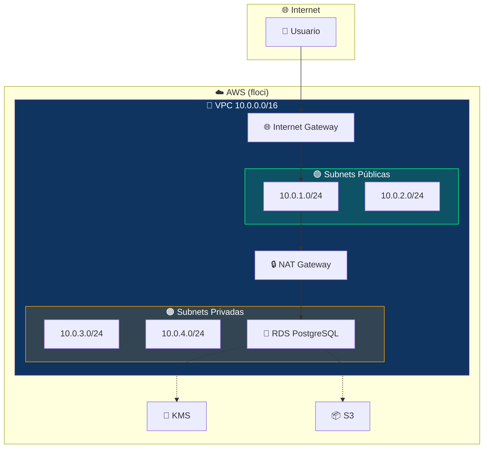
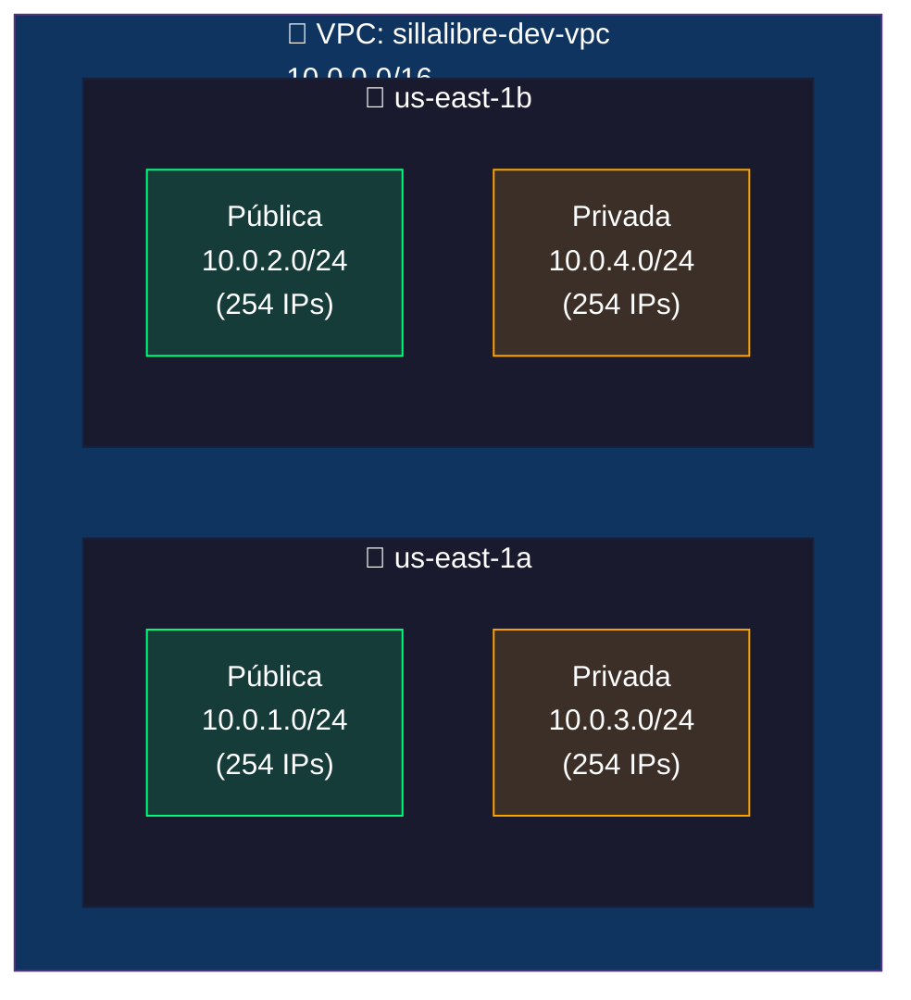
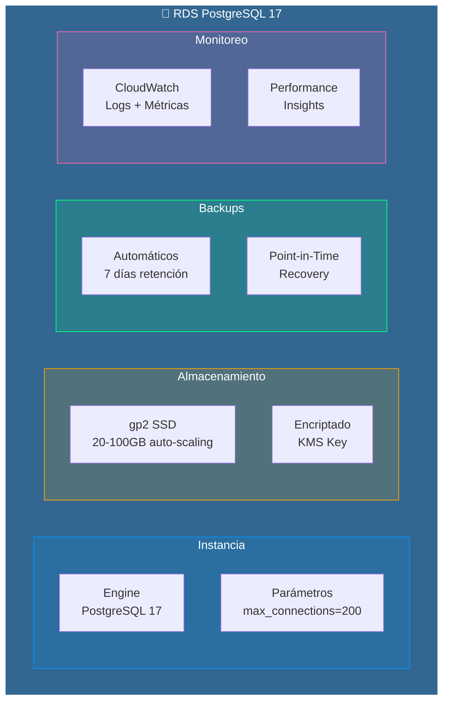
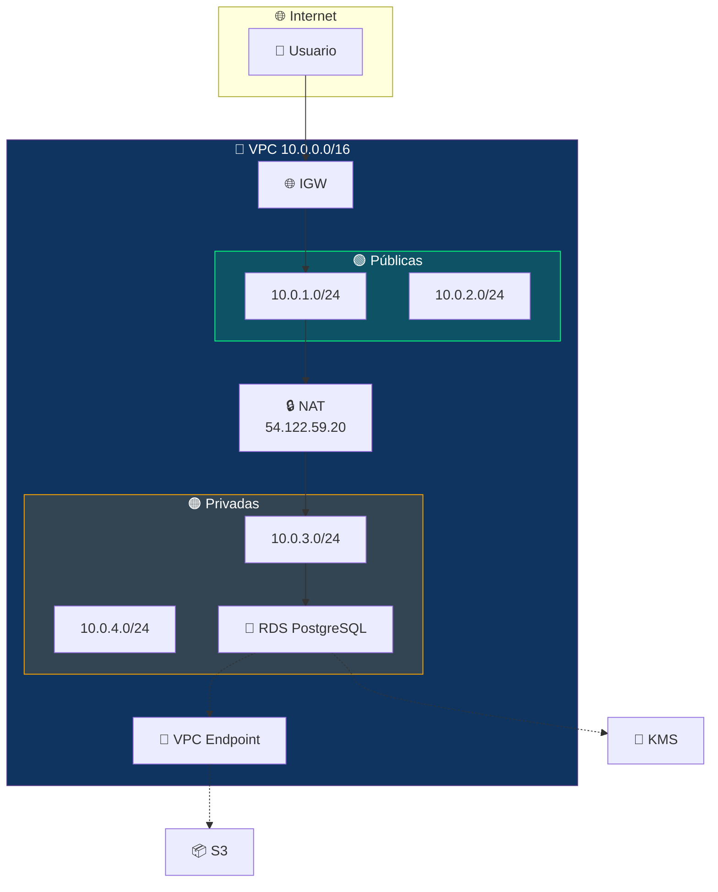
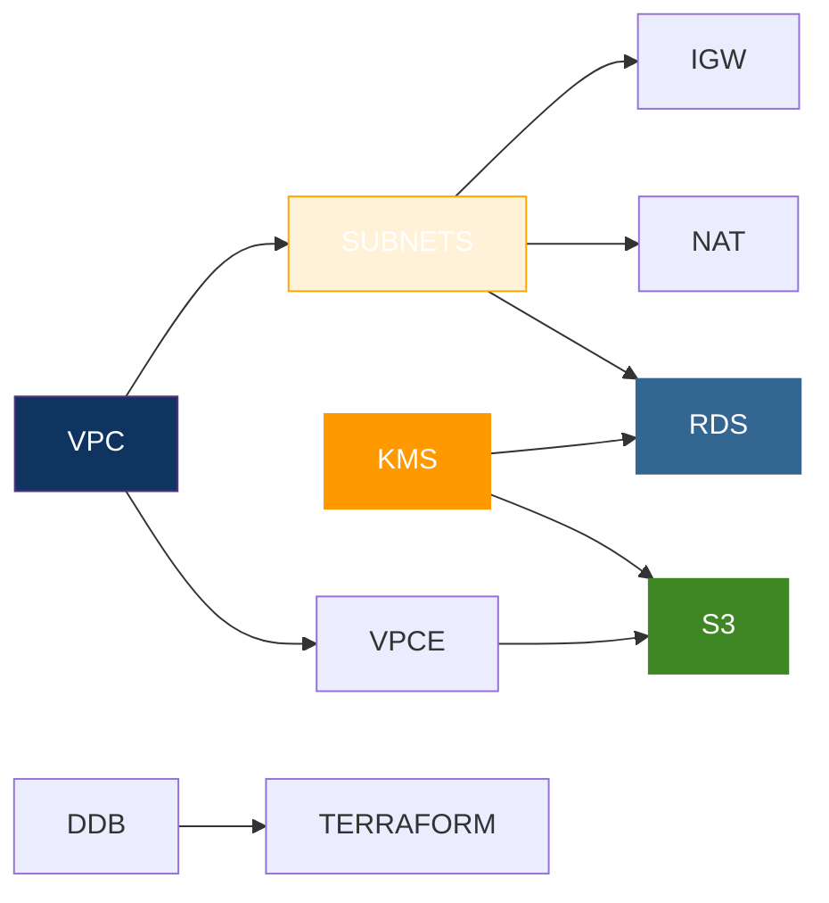

# Guía Completa de Infraestructura AWS - SillaLibre

## Índice

1. [Visión General](#1-visión-general)
2. [VPC (Virtual Private Cloud)](#2-vpc-virtual-private-cloud)
3. [Subnets Públicas y Privadas](#3-subnets-públicas-y-privadas)
4. [Internet Gateway (IGW)](#4-internet-gateway-igw)
5. [NAT Gateway](#5-nat-gateway)
6. [Route Tables](#6-route-tables)
7. [RDS PostgreSQL](#7-rds-postgresql)
8. [KMS (Key Management Service)](#8-kms-key-management-service)
9. [S3 (Simple Storage Service)](#9-s3-simple-storage-service)
10. [VPC Endpoint S3](#10-vpc-endpoint-s3)
11. [DynamoDB](#11-dynamodb)
12. [Docker Compose (Local)](#12-docker-compose-local)
13. [Terraform Workspaces](#13-terraform-workspaces)
14. [Flujo Completo de Datos](#14-flujo-completo-de-datos)

---

## 1. Visión General

### ¿Qué construimos?

Una infraestructura completa en AWS (floci) para la aplicación SillaLibre, compuesta por:

```
┌─────────────────────────────────────────────────────────────┐
│                    INFRAESTRUCTURA                          │
├─────────────────────────────────────────────────────────────┤
│  🔴 RED         → VPC, Subnets, NAT, IGW                   │
│  🟢 COMPUTO     → RDS PostgreSQL 17                         │
│  🟡 ALMACENAMIENTO → S3, DynamoDB                           │
│  🔐 SEGURIDAD   → KMS, Security Groups                      │
│  ⚙️ DEVOPS      → Terraform, Workspaces, Docker Compose     │
└─────────────────────────────────────────────────────────────┘
```

### Diagrama de Alto Nivel



---

## 2. VPC (Virtual Private Cloud)

### ¿Qué es?

Una VPC es tu **propia red privada virtual** dentro de AWS. Es como tener tu propio data center en la nube, pero sin comprar hardware.

### Analogía

```
VPC = Tu casa

- Tiene paredes (firewall)
- Tiene habitaciones (subnets)
- Tiene una puerta principal (Internet Gateway)
- Puedes controlar quién entra y sale
```

### Configuración en nuestro proyecto

```hcl
resource "aws_vpc" "main" {
  cidr_block           = "10.0.0.0/16"    # 65,536 IPs disponibles
  enable_dns_support   = true             # Resolución DNS
  enable_dns_hostnames = true             # Hostnames DNS

  tags = {
    Name = "sillalibre-dev-vpc"
  }
}
```

### ¿Qué es un CIDR?

```
10.0.0.0/16

10.0.0.0  → Dirección de red
/16       → Máscara de subred (16 bits para red, 16 para hosts)

Cálculo:
- 2^16 = 65,536 IPs disponibles
- Rango: 10.0.0.0 - 10.0.255.255
```

### Diagrama de la VPC



### ¿Por qué usar VPC?

| Beneficio | Descripción |
|-----------|-------------|
| **Aislamiento** | Tu red está separada de otros clientes de AWS |
| **Control** | Tú decides qué tráfico entra y sale |
| **Seguridad** | Security Groups y NACLs para filtrar tráfico |
| **Flexibilidad** | Subnets públicas y privadas según necesidad |

---

## 3. Subnets Públicas y Privadas

### ¿Qué son?

Las subnets son **subdivisiones de tu VPC**. Como habitaciones dentro de tu casa.

```
VPC (tu casa)
├── Subnet Pública (sala de estar) → Visible desde afuera
└── Subnet Privada (dormitorio)    → Solo acceso interno
```

### Subnets Públicas

```hcl
resource "aws_subnet" "public" {
  vpc_id                  = aws_vpc.main.id
  cidr_block              = "10.0.1.0/24"
  availability_zone       = "us-east-1a"
  map_public_ip_on_launch = true  # ← Clave: asigna IP pública

  tags = {
    Name = "sillalibre-dev-public-1"
    Tier = "public"
  }
}
```

**Características:**
- ✅ Acceso directo a Internet
- ✅ Asigna IP pública automáticamente
- ✅ Ideal para: Load Balancers, Bastion Hosts, NAT Gateway

### Subnets Privadas

```hcl
resource "aws_subnet" "private" {
  vpc_id            = aws_vpc.main.id
  cidr_block        = "10.0.3.0/24"
  availability_zone = "us-east-1a"
  # No tiene map_public_ip_on_launch

  tags = {
    Name = "sillalibre-dev-private-1"
    Tier = "private"
  }
}
```

**Características:**
- ❌ Sin acceso directo a Internet
- ❌ Sin IP pública
- ✅ Ideal para: Bases de datos, aplicaciones internas

### ¿Por qué separarlas?

```
INTERNET
    │
    ▼
┌─────────────────────────────────────┐
│  SUBNET PÚBLICA                     │
│  ┌─────────────┐                    │
│  │ Load Balancer│ ← Expuesto        │
│  └─────────────┘                    │
└─────────────────────────────────────┘
    │
    ▼
┌─────────────────────────────────────┐
│  SUBNET PRIVADA                     │
│  ┌─────────────┐                    │
│  │     RDS     │ ← No expuesto     │
│  └─────────────┘                    │
└─────────────────────────────────────┘

Si alguien ataca el Load Balancer,
la base de datos está protegida.
```

### Tabla Comparativa

| Característica | Pública | Privada |
|----------------|---------|---------|
| IP pública | ✅ Sí | ❌ No |
| Acceso a Internet | ✅ Directo | ❌ Solo vía NAT |
| Costo | Mayor | Menor |
| Seguridad | Menor | Mayor |
| Uso típico | Web servers | Bases de datos |

### Availability Zones (AZ)

```
us-east-1a          us-east-1b
┌──────────────┐   ┌──────────────┐
│ Subnet Pub 1 │   │ Subnet Pub 2 │
│ Subnet Priv 1│   │ Subnet Priv 2│
└──────────────┘   └──────────────┘

¿Por qué 2 AZ?
- Alta disponibilidad
- Si falla us-east-1a, us-east-1b sigue funcionando
- RDS Multi-AZ usa ambas para replicación
```

---

## 4. Internet Gateway (IGW)

### ¿Qué es?

Es la **puerta de entrada/salida** de tu VPC a Internet. Como la puerta principal de tu casa.

```
INTERNET ←→ IGW ←→ VPC
```

### Configuración

```hcl
resource "aws_internet_gateway" "main" {
  vpc_id = aws_vpc.main.id

  tags = {
    Name = "sillalibre-dev-igw"
  }
}
```

### ¿Cómo funciona?

```
┌──────────────┐
│   INTERNET   │
│  (World Wide │
│     Web)     │
└──────┬───────┘
       │
       ▼
┌──────────────┐
│     IGW      │  ← Filtra y enruta tráfico
└──────┬───────┘
       │
       ▼
┌──────────────┐
│      VPC     │
└──────────────┘
```

### Reglas importantes

| Regla | Descripción |
|-------|-------------|
| **1 IGW por VPC** | Solo puedes asociar un IGW a cada VPC |
| **Bidireccional** | Permite entrada Y salida de tráfico |
| **Sin costo** | IGW es gratis, solo pagas por datos transferidos |

---

## 5. NAT Gateway

### ¿Qué es?

NAT (Network Address Translation) permite que los recursos en **subnets privadas** accedan a Internet sin exponerse.

### Analogía

```
Sin NAT:
  Dormitorio (privada) → No puede salir a la calle

Con NAT:
  Dormitorio (privada) → Sale por la puerta trasera (NAT) → Internet
```

### Configuración

```hcl
# IP Elástica (IP fija)
resource "aws_eip" "nat" {
  domain = "vpc"

  tags = {
    Name = "sillalibre-dev-nat-eip"
  }
}

# NAT Gateway
resource "aws_nat_gateway" "main" {
  allocation_id = aws_eip.nat.id
  subnet_id     = aws_subnet.public[0].id  # ← En subnet pública

  tags = {
    Name = "sillalibre-dev-nat"
  }
}
```

### Flujo de datos con NAT

```
┌─────────────────────────────────────────────┐
│                 INTERNET                    │
└──────────────────┬──────────────────────────┘
                   │
                   ▼
┌─────────────────────────────────────────────┐
│           SUBNET PÚBLICA                    │
│  ┌─────────────────────────────────────┐   │
│  │         NAT GATEWAY                 │   │
│  │  IP: 54.122.59.20 (fijo)            │   │
│  └─────────────────────────────────────┘   │
└──────────────────┬──────────────────────────┘
                   │
                   ▼
┌─────────────────────────────────────────────┐
│           SUBNET PRIVADA                    │
│  ┌─────────────────────────────────────┐   │
│  │              RDS                    │   │
│  │  - Actualizaciones de seguridad     │   │
│  │  - Descarga de dependencias         │   │
│  └─────────────────────────────────────┘   │
└─────────────────────────────────────────────┘
```

### ¿Para qué sirve en RDS?

```
RDS necesita internet para:
├── Descargar actualizaciones de PostgreSQL
├── Acceder a CloudWatch Logs
├── Sincronizar snapshots
└── Actualizaciones de seguridad

Pero NO puede tener IP pública (seguridad)
→ NAT Gateway resuelve esto
```

### Costo

| Componente | Costo aproximado |
|------------|------------------|
| NAT Gateway | ~$32/mes |
| IP Elástica | ~$3.6/mes (si no se usa) |
| Datos transferidos | ~$0.045/GB |

**Nota:** En floci es gratis, en AWS real es un costo a considerar.

---

## 6. Route Tables

### ¿Qué son?

Las tablas de enrutamiento definen **a dónde va el tráfico**. Son como el GPS de tu red.

### Configuración

```hcl
# Route Table Pública
resource "aws_route_table" "public" {
  vpc_id = aws_vpc.main.id

  route {
    cidr_block = "0.0.0.0/0"      # Todo el tráfico
    gateway_id = aws_internet_gateway.main.id  # → Salir por IGW
  }

  tags = {
    Name = "sillalibre-dev-public-rt"
  }
}

# Route Table Privada
resource "aws_route_table" "private" {
  vpc_id = aws_vpc.main.id

  route {
    cidr_block     = "0.0.0.0/0"          # Todo el tráfico
    nat_gateway_id = aws_nat_gateway.main.id  # → Salir por NAT
  }

  tags = {
    Name = "sillalibre-dev-private-rt"
  }
}
```

### Diagrama de Rutas

```
TRÁFICO SALIENTE

Subnet Pública:
  0.0.0.0/0 → IGW → Internet ✓

Subnet Privada:
  0.0.0.0/0 → NAT → IGW → Internet ✓

TRÁFICO INTERNO (dentro de la VPC)

10.0.0.0/16 → Local → Dentro de la VPC ✓
```

### Asociación de Subnets a Route Tables

```hcl
resource "aws_route_table_association" "public" {
  subnet_id      = aws_subnet.public[0].id
  route_table_id = aws_route_table.public.id
}

resource "aws_route_table_association" "private" {
  subnet_id      = aws_subnet.private[0].id
  route_table_id = aws_route_table.private.id
}
```

### Tabla Resumen

| Route Table | CIDR | Destino | Uso |
|-------------|------|---------|-----|
| public | 0.0.0.0/0 | IGW | Salir a Internet directamente |
| private | 0.0.0.0/0 | NAT | Salir a Internet vía NAT |
| both | 10.0.0.0/16 | Local | Comunicación interna VPC |

---

## 7. RDS PostgreSQL

### ¿Qué es?

RDS (Relational Database Service) es una **base de datos relacional administrada** por AWS. No necesitas instalar, parchar ni administrar el servidor.

### Analogía

```
Sin RDS (self-hosted):
  Tú compras el servidor
  Tú instalas PostgreSQL
  Tú configuras backups
  Tú aplicas parches de seguridad
  Tú monitoreas el rendimiento

Con RDS:
  AWS hace todo eso
  Tú solo creas la base de datos
  Tú pagas por uso
```

### Configuración

```hcl
resource "aws_db_instance" "main" {
  identifier = "sillalibre-dev-db"

  # Engine
  engine         = "postgres"
  engine_version = "17"              # Última versión LTS
  instance_class = "db.t4g.micro"    # 2 vCPU, 1GB RAM

  # Storage
  allocated_storage     = 20         # 20 GB iniciales
  max_allocated_storage = 100        # Auto-scaling hasta 100GB
  storage_encrypted     = true       # Encriptado con KMS

  # Database
  db_name  = "sillalibre"
  username = "sillalibre"
  password = var.db_password

  # Network
  db_subnet_group_name   = aws_db_subnet_group.main.name
  vpc_security_group_ids = [aws_security_group.rds.id]
  publicly_accessible    = false      # ← No expuesto a Internet

  # Backups
  backup_retention_period = 7         # 7 días de retención
  backup_window          = "03:00-04:00"

  # Monitoring
  performance_insights_enabled = true
  enabled_cloudwatch_logs_exports = ["postgresql"]

  # Protection
  deletion_protection = false  # dev: false, prod: true
}
```

### Componentes de RDS



### Parámetros Importantes

| Parámetro | Valor | Significado |
|-----------|-------|-------------|
| `max_connections` | 200 | Máximo de conexiones simultáneas |
| `log_min_duration_statement` | 1000 | Log queries > 1 segundo |
| `backup_retention_period` | 7 | Backups por 7 días |
| `performance_insights_enabled` | true | Análisis de rendimiento |

### Security Group para RDS

```hcl
resource "aws_security_group" "rds" {
  vpc_id = var.vpc_id

  ingress {
    description = "PostgreSQL desde VPC"
    from_port   = 5432
    to_port     = 5432
    protocol    = "tcp"
    cidr_blocks = [var.vpc_cidr]  # ← Solo desde la VPC
  }

  egress {
    from_port   = 0
    to_port     = 0
    protocol    = "-1"
    cidr_blocks = ["0.0.0.0/0"]
  }
}
```

**Resultado:** RDS solo acepta conexiones desde dentro de la VPC (10.0.0.0/16).

### Conexión a RDS

```bash
# Desde una EC2 en la VPC
psql -h sillalibre-dev-db.xxxx.us-east-1.rds.amazonaws.com \
     -U sillalibre \
     -d sillalibre

# Desde local (con port forwarding via bastion)
ssh -L 5432:sillalibre-dev-db.xxxx.us-east-1.rds.amazonaws.com:5432 \
    bastion@public-ip
psql -h localhost -U sillalibre -d sillalibre
```

---

## 8. KMS (Key Management Service)

### ¿Qué es?

KMS es un servicio de **gestión de claves de encriptación**. Como una caja fuerte digital que protege tus datos.

### Analogía

```
KMS = Caja fuerte del banco

- Solo tú tienes la llave
- El banco (AWS) guarda la caja fuerte
- Si pierdes la llave, pierdes los datos
- Puedes dar acceso a otros (usuarios IAM)
```

### Configuración

```hcl
resource "aws_kms_key" "main" {
  description             = "Clave KMS principal para SillaLibre"
  deletion_window_in_days = 30          # 30 días para eliminar
  enable_key_rotation     = true        # Rotación automática cada 365 días

  policy = jsonencode({
    Version = "2012-10-17"
    Statement = [
      {
        Sid    = "EnableRootAccount"
        Effect = "Allow"
        Principal = {
          AWS = "arn:aws:iam::${data.aws_caller_identity.current.account_id}:root"
        }
        Action   = "kms:*"
        Resource = "*"
      }
    ]
  })

  tags = {
    Name = "sillalibre-dev"
  }
}

resource "aws_kms_alias" "main" {
  name          = "alias/sillalibre-dev"
  target_key_id = aws_kms_key.main.key_id
}
```

### ¿Qué encripta?

```
KMS Key (alias/sillalibre-dev)
    │
    ├──→ RDS Storage (disco encriptado)
    ├──→ S3 Bucket (objetos encriptados)
    └──→ Terraform State (estado encriptado)
```

### ¿Por qué encriptar?

| Razón | Descripción |
|-------|-------------|
| **Cumplimiento** | GDPR, HIPAA, SOC2 requieren encriptación |
| **Seguridad** | Si roban el disco, los datos están encriptados |
| **Auditoría** | CloudTrail registra quién usó la clave |

### Rotación Automática

```
Día 0:    Key v1 creada
Día 365:  Key v2 creada (rotación automática)
Día 730:  Key v3 creada
...

- AWS maneja la rotación automáticamente
- Los datos encriptados con Key v1 siguen siendo legibles
- No necesitas re-encriptar datos existentes
```

---

## 9. S3 (Simple Storage Service)

### ¿Qué es?

S3 es **almacenamiento de objetos** ilimitado. Como un disco duro en la nube, pero escalable y duradero.

### Analogía

```
S3 = Almacén de una fáctería

- Puedes guardar cualquier cosa (objetos)
- Cada objeto tiene un nombre (key/clave)
- Se organiza en carpetas (prefix)
- Puedes guardar versiones (versioning)
- Puedes mover aarchive antiguos (lifecycle)
```

### Configuración

```hcl
resource "aws_s3_bucket" "main" {
  bucket = "sillalibre-dev-assets"

  tags = {
    Name = "sillalibre-dev-assets"
  }
}

# Versionado
resource "aws_s3_bucket_versioning" "main" {
  bucket = aws_s3_bucket.main.id
  versioning_configuration {
    status = "Enabled"
  }
}

# Encriptación
resource "aws_s3_bucket_server_side_encryption_configuration" "main" {
  bucket = aws_s3_bucket.main.id
  rule {
    apply_server_side_encryption_by_default {
      sse_algorithm     = "aws:kms"
      kms_master_key_id = var.kms_key_arn
    }
  }
}

# Bloqueo de acceso público
resource "aws_s3_bucket_public_access_block" "main" {
  bucket = aws_s3_bucket.main.id
  block_public_acls       = true
  block_public_policy     = true
  ignore_public_acls      = true
  restrict_public_buckets = true
}

# Lifecycle (ahorro de costos)
resource "aws_s3_bucket_lifecycle_configuration" "main" {
  bucket = aws_s3_bucket.main.id
  rule {
    id     = "transition-to-ia"
    status = "Enabled"
    transition {
      days          = 30
      storage_class = "STANDARD_IA"  # Infrequent Access
    }
    transition {
      days          = 90
      storage_class = "GLACIER"      # Archivo
    }
    expiration {
      days = 365                      # Eliminar después de 1 año
    }
  }
}
```

### Lifecycle de Costos

```
Día 0-30:    STANDARD       → $0.023/GB/mes
Día 31-90:   STANDARD_IA    → $0.0125/GB/mes (50% más barato)
Día 91-365:  GLACIER        → $0.004/GB/mes (83% más barato)
Día 366+:    ELIMINADO      → $0

Ejemplo con 1TB:
- Mes 1:  $23.00
- Mes 2:  $12.50
- Mes 4:  $4.00
- Mes 13: $0 (eliminado)
```

### Acceso a S3

```bash
# CLI
aws s3 ls s3://sillalibre-dev-assets/
aws s3 cp archivo.txt s3://sillalibre-dev-assets/
aws s3 sync ./carpeta s3://sillalibre-dev-assets/carpeta/

# SDK (Python)
import boto3
s3 = boto3.client('s3')
s3.upload_file('archivo.txt', 'sillalibre-dev-assets', 'archivo.txt')
```

---

## 10. VPC Endpoint S3

### ¿Qué es?

Un VPC Endpoint permite que los recursos en tu VPC accedan a S3 **sin pasar por Internet**.

### Sin Endpoint vs Con Endpoint

```
SIN ENDPOINT:
  RDS → Internet → S3
  (Tráfico sale de AWS, vuelve a entrar)

CON ENDPOINT:
  RDS → VPC Endpoint → S3
  (Tráfico nunca sale de AWS)
```

### Diagrama

```
┌─────────────────────────────────────────────────┐
│                    VPC                          │
│                                                 │
│  ┌─────────┐      ┌──────────────┐            │
│  │   RDS   │ ───→ │ VPC Endpoint │ ───→ S3   │
│  └─────────┘      └──────────────┘            │
│                                                 │
│  Tráfico: Dentro de AWS (gratis, rápido)       │
└─────────────────────────────────────────────────┘
```

### Configuración

```hcl
resource "aws_vpc_endpoint" "s3" {
  vpc_id            = var.vpc_id
  service_name      = "com.amazonaws.us-east-1.s3"
  vpc_endpoint_type = "Gateway"

  route_table_ids = var.private_route_table_ids

  tags = {
    Name = "sillalibre-dev-s3-endpoint"
  }
}
```

### Beneficios

| Beneficio | Descripción |
|-----------|-------------|
| **Seguridad** | Tráfico no sale de AWS |
| **Rendimiento** | Latencia más baja |
| **Costo** | Tráfico via endpoint es gratis |
| **Ancho de banda** | Sin límites de Internet |

---

## 11. DynamoDB

### ¿Qué es?

DynamoDB es una **base de datos NoSQL** administrada. En nuestro caso, se usa para **locking de Terraform**.

### Analogía

```
DynamoDB (para Terraform) = Ticket de parking

- Cuando Terraform empieza a trabajar, "toma" el ticket
- Nadie más puede trabajar hasta que Terraform termine
- Evita que dos personas modifiquen la infra al mismo tiempo
```

### Configuración

```hcl
resource "aws_dynamodb_table" "tflock" {
  name         = "sillalibre-tflock"
  billing_mode = "PAY_PER_REQUEST"
  hash_key     = "LockID"

  attribute {
    name = "LockID"
    type = "S"
  }

  tags = {
    Name    = "sillalibre-tflock"
    Purpose = "terraform-locking"
  }
}
```

### ¿Cómo funciona el locking?

```
Persona A ejecuta terraform apply:
  1. Terraform verifica DynamoDB
  2. No hay lock → Crea lock "Persona A"
  3. Terraform aplica cambios
  4. Terraform libera lock

Persona B ejecuta terraform apply (mientras A trabaja):
  1. Terraform verifica DynamoDB
  2. Hay lock de "Persona A" → ESPERA o FALLA
  3. No puede aplicar hasta que A termine
```

### ¿Por qué DynamoDB y no S3?

| Opción | Pros | Contras |
|--------|------|---------|
| **S3 State Lock** | Simple | Sin locking real |
| **DynamoDB Locking** | Locking real, consistente | Requiere DynamoDB adicional |

**DynamoDB es el estándar para locking de Terraform.**

---

## 12. Docker Compose (Local)

### ¿Qué es?

Docker Compose permite ejecutar **múltiples servicios** en tu máquina local para desarrollo.

### Configuración

```yaml
services:
  postgres:
    image: bitnami/postgresql:17
    ports: ["5432:5432"]
    environment:
      POSTGRESQL_USERNAME: sillalibre
      POSTGRESQL_PASSWORD: dev_password
      POSTGRESQL_DATABASE: sillalibre_dev
    volumes: ["postgres_data:/bitnami/postgresql"]

  kafka:
    image: bitnami/kafka:3.7
    ports: ["9092:9092"]
    environment:
      KAFKA_CFG_NODE_ID: 1
      KAFKA_CFG_PROCESS_ROLES: broker,controller
      KAFKA_CFG_CONTROLLER_QUORUM_VOTERS: 1@kafka:9093
      KAFKA_CFG_LISTENERS: PLAINTEXT://:9092,CONTROLLER://:9093
      KAFKA_CFG_ADVERTISED_LISTENERS: PLAINTEXT://localhost:9092
    volumes: ["kafka_data:/bitnami/kafka"]

  rabbitmq:
    image: bitnami/rabbitmq:3.13
    ports: ["5672:5672", "15672:15672"]
    environment:
      RABBITMQ_USERNAME: guest
      RABBITMQ_PASSWORD: guest
    volumes: ["rabbitmq_data:/bitnami/rabbitmq"]

volumes:
  postgres_data:
  kafka_data:
  rabbitmq_data:
```

### ¿Por qué usar Docker Compose?

```
DESARROLLADOR LOCAL:
  Docker Compose → PostgreSQL, Kafka, RabbitMQ
  (No necesitas instalar nada en tu máquina)

PRODUCCIÓN (AWS):
  RDS → PostgreSQL
  MSK → Kafka (futuro)
  AmazonMQ → RabbitMQ (futuro)

Mismo código, diferente infraestructura
```

### Comandos Útiles

```bash
# Iniciar todos los servicios
docker compose up -d

# Ver estado
docker compose ps

# Ver logs
docker compose logs -f postgres

# Detener
docker compose down

# Eliminar datos
docker compose down -v
```

### Script de Inicialización

```bash
#!/bin/bash
# Crea bases de datos por microservicio
SERVICES=("identidad" "establecimiento" "personal" "reserva" 
          "notificacion" "fidelizacion" "resena" "descubrimiento")

for svc in "${SERVICES[@]}"; do
  docker compose exec -T postgres psql -U sillalibre -d postgres \
    -c "CREATE DATABASE ${svc}_db;" 2>/dev/null || true
done
```

---

## 13. Terraform Workspaces

### ¿Qué son?

Workspaces permiten tener **múltiples estados** para la misma configuración de Terraform.

### Analogía

```
Workspaces = Pestañas del navegador

- Misma URL (código Terraform)
- Diferente contenido (estado/infraestructura)
- Puedes cambiar entre ellos
```

### Configuración

```hcl
# environments/dev.tfvars
environment        = "dev"
instance_class     = "db.t4g.micro"
deletion_protection = false

# environments/prod.tfvars
environment        = "prod"
instance_class     = "db.t4g.small"
deletion_protection = true
```

### Uso

```bash
# Crear workspaces
terraform workspace new dev
terraform workspace new prod

# Cambiar entre ellos
terraform workspace select dev
terraform apply -var-file="environments/dev.tfvars"

terraform workspace select prod
terraform apply -var-file="environments/prod.tfvars"
```

### Separación de Estado

```
sillalibre-tfstate-000000000000/
├── env:/dev/
│   └── terraform.tfstate    ← Estado de dev
└── env:/prod/
    └── terraform.tfstate    ← Estado de prod
```

### Comparación

| Aspecto | Dev | Prod |
|---------|-----|------|
| CIDR | 10.0.0.0/16 | 10.1.0.0/16 |
| RDS Instance | db.t4g.micro | db.t4g.small |
| deletion_protection | false | true |
| Costo estimado | ~$50/mes | ~$150/mes |

---

## 14. Flujo Completo de Datos

### Conexión de Componentes



### Escenario 1: Usuario accede a la aplicación

```
1. Usuario → App (en ECS/EKS futuro)
2. App → RDS (consulta datos)
3. RDS → Responde con datos
4. App → Responde al usuario
```

### Escenario 2: Backup automático

```
1. RDS → Crea snapshot automático
2. Snapshot → S3 (almacenamiento)
3. KMS → Encripta el snapshot
4. CloudWatch → Registra evento
```

### Escenario 3: Deploy de código

```
1. Developer → git push
2. GitHub Actions → terraform plan
3. terraform plan → Verifica cambios
4. terraform apply → Aplica cambios
5. DynamoDB → Lock durante apply
6. AWS → Actualiza recursos
```

---

## Resumen de Recursos

| Componente | Recurso AWS | Propósito | Costo |
|------------|-------------|-----------|-------|
| **VPC** | aws_vpc | Red privada virtual | Gratis |
| **Subnets** | aws_subnet | Divisiones de red | Gratis |
| **IGW** | aws_internet_gateway | Acceso a Internet | Gratis |
| **NAT Gateway** | aws_nat_gateway | Internet para privadas | ~$32/mes |
| **Route Tables** | aws_route_table | Enrutamiento | Gratis |
| **RDS** | aws_db_instance | Base de datos | ~$12-50/mes |
| **KMS** | aws_kms_key | Encriptación | $1/key + $0.03/10K requests |
| **S3** | aws_s3_bucket | Almacenamiento | $0.023/GB/mes |
| **VPC Endpoint** | aws_vpc_endpoint | Acceso privado S3 | Gratis (Gateway) |
| **DynamoDB** | aws_dynamodb_table | Locking Terraform | ~$0.25/mes |

---

## Diagrama de Dependencias



---

## Recursos Adicionales

### Para aprender más

| Tema | Recurso |
|------|---------|
| VPC | [AWS VPC Documentation](https://docs.aws.amazon.com/vpc/) |
| RDS | [AWS RDS User Guide](https://docs.aws.amazon.com/rds/) |
| S3 | [AWS S3 Developer Guide](https://docs.aws.amazon.com/s3/) |
| KMS | [AWS KMS Developer Guide](https://docs.aws.amazon.com/kms/) |
| Terraform | [Terraform Workspaces](https://www.terraform.io/language/state/workspaces) |

---

> **Archivo:** `estudio/guia-infraestructura-completa.md`
> **Autor:** Arquitecto DevOps & SRE
> **Fecha:** 2026-09-27
