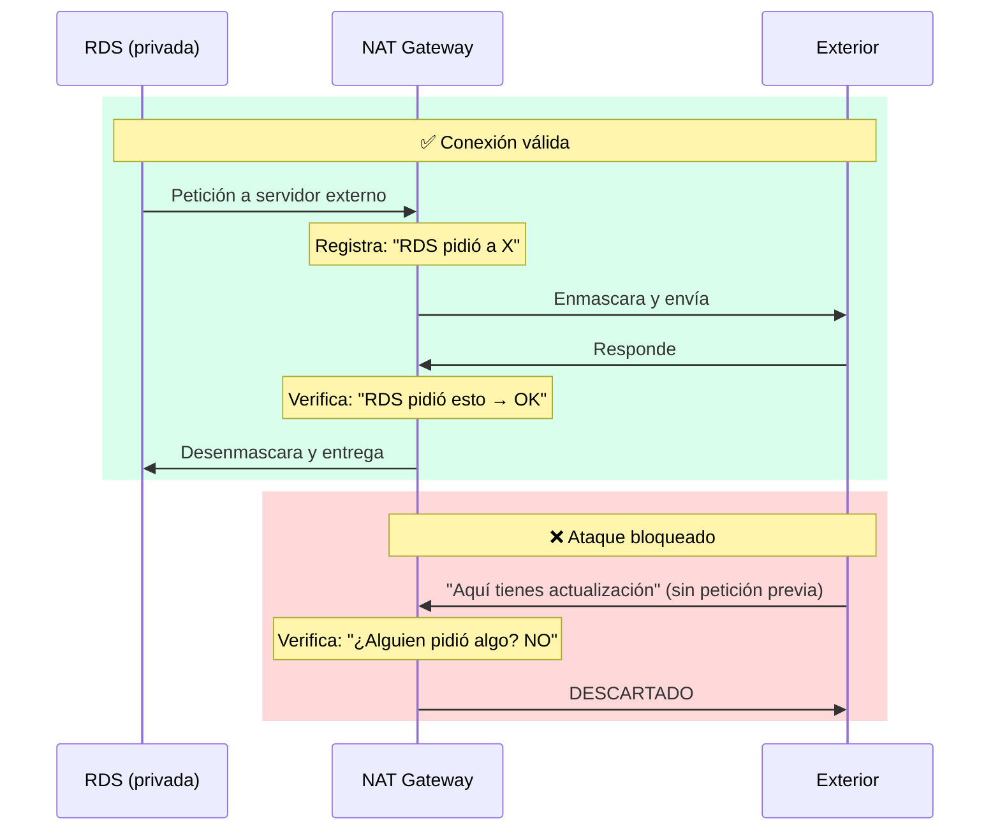

# NAT Gateway - Profundización

## ¿Qué es NAT?

**NAT = Network Address Translation** (Traducción de Direcciones de Red)

No es un DNS. Es un **traductor de direcciones IP** que oculta las IPs privadas del mundo exterior.

```
DNS = Traduce nombres a IPs
      "google.com" → 142.250.80.46

NAT = Traduce IPs privadas a públicas
      10.0.3.15 → 54.122.59.20
```

---

## Analogía Simple

```
Tu casa tiene 2 tipos de habitaciones:

SALA PÚBLICA (Subnet Pública)
  → Tiene ventana grande al exterior
  → Puedes ver y ser visto desde la calle
  → Los invitados pueden entrar

DORMITORIO PRIVADO (Subnet Privada)
  → No tiene ventanas al exterior
  → Nadie de afuera puede verte
  - Pero... ¿cómo sacas la basura?

NAT GATEWAY = La puerta trasera de servicio
  → Solo tú puedes salir
  → Nadie de afuera puede entrar por ahí
  → La basura sale, pero nadie entra
```

---

## El Problema que Resuelve

```
SIN NAT:
┌─────────────────────────────────────────┐
│  SUBNET PRIVADA                         │
│  ┌─────────┐                            │
│  │   RDS   │ ─── ✗ No puede salir      │
│  └─────────┘     a Internet             │
│                                         │
│  Problema: No puede actualizar          │
│  PostgreSQL, descargar parches,         │
│  enviar logs a CloudWatch               │
└─────────────────────────────────────────┘

CON NAT:
┌─────────────────────────────────────────┐
│  SUBNET PRIVADA                         │
│  ┌─────────┐                            │
│  │   RDS   │ ─── ✓ Sale por NAT        │
│  └─────────┘                            │
└────────────────────┬────────────────────┘
                     │
                     ▼
┌─────────────────────────────────────────┐
│  SUBNET PÚBLICA                         │
│  ┌─────────────┐                        │
│  │ NAT GATEWAY │ ─── ✓ Tiene IP pública │
│  └─────────────┘                        │
└────────────────────┬────────────────────┘
                     │
                     ▼
                 INTERNET
```

---

## Flujo de Datos - Enmascaramiento

```
RDS quiere descargar una actualización:

1. RDS (10.0.3.15) envía paquete:
   Origen: 10.0.3.15
   Destino: 143.204.93.15 (servidor de actualizaciones)

2. Paquete llega a NAT Gateway:
   NAT reemplaza la dirección origen:
   Origen: 10.0.3.15 → 54.122.59.20 (IP del NAT)
   Destino: 143.204.93.15

3. Servidor responde:
   Origen: 143.204.93.15
   Destino: 54.122.59.20 (IP del NAT)

4. NAT traduce de vuelta:
   Origen: 143.204.93.15
   Destino: 10.0.3.15 (RDS original)
```

---

## Diagrama del Proceso

```
RED PRIVADA                    NAT                    EXTERIOR
┌─────────────┐         ┌─────────────┐         ┌─────────────┐
│     RDS     │         │  NAT GATE   │         │  INTERNET   │
│  10.0.3.15  │ ──────→ │  54.122.x.x │ ──────→ │             │
│             │         │             │         │             │
│  "Quiero    │         │ "Enmascaro  │         │ "Recibo de  │
│   descargar │         │  tu IP con  │         │  54.122.x.x │
│   algo"     │         │  la mía"    │         │  y respondo"│
│             │         │             │         │             │
│             │ ←────── │ ←────────── │ ←────── │             │
│  "Recibo    │         │ "Desenmascaro│        │  "Envío     │
│   respuesta"│         │  y te devuelvo"       │  respuesta" │
└─────────────┘         └─────────────┘         └─────────────┘
```

---

## Seguridad: Conexiones Stateful

NAT Gateway es **stateful** (conoce el estado de las conexiones). Solo permite tráfico que sea respuesta a conexiones que él mismo inició.

### ¿Qué significa?

```
NAT Gateway lleva un registro de TODAS las salidas:

"RDS (10.0.3.15) pidió algo al servidor X"
"Lambda (10.0.2.20) pidió algo al servidor Y"
"EC2 (10.0.1.10) pidió algo al servidor Z"
```

### Si alguien intenta entrar sin haber sido invitado

```
ATACANTE envía paquete a 54.122.59.20:
  Origen: 143.204.93.15 (suplantando servidor de actualizaciones)
  Destino: 54.122.59.20 (NAT)

NAT Gateway revisa su registro:
  "¿Alguien de adentro pidió algo a 143.204.93.15?"
  "NO → Descarto el paquete"

❌ BLOQUEADO
```

---

## Ejemplo: Conexión Válida vs Ataque

### Conexión Válida

```
CONEXIÓN VÁLIDA:
─────────────────────────────────────────────────
1. RDS (10.0.3.15) → NAT: "Quiero descargar de 143.204.93.15"
2. NAT registra: "10.0.3.15 pidió a 143.204.93.15"
3. NAT → 143.204.93.15: "Alguien quiere descargar"
4. 143.204.93.15 → NAT: "Aquí tienes el archivo"
5. NAT verifica: "Sí, 10.0.3.15 pidió esto → Permito"
6. NAT → RDS: "Aquí tienes"

✅ EXITOSO
```

### Ataque Bloqueado

```
CONEXIÓN INVÁLIDA (ATAQUE):
─────────────────────────────────────────────────
1. ATACANTE (143.204.93.15) → NAT: "Aquí tienes actualización"
2. NAT verifica: "¿Alguien pidió algo a 143.204.93.15?"
3. NAT: "NO → No sé de qué hablas"
4. ❌ DESCARTADO
```

---

## Diagrama de Secuencia



---

## Analogía del Guardia

```
NAT Gateway = Puerta con guardia

Guardia lleva lista de invitados:
  "Javier pidió pizza → Si llega pizza, déjenla pasar"
  "María pidió flor → Si llega flor, déjenla pasar"

Si alguien llega sin estar en la lista:
  "¿Quién eres? No te conozco → Fuera"
```

---

## Tabla Resumen: Ataques Comunes

| Ataque | Qué intenta | Resultado |
|--------|-------------|-----------|
| **Inyectar respuesta** | Enviar datos sin petición previa | ❌ Descartado |
| **Suplantar servidor** | Hacerse pasar por servidor actualizaciones | ❌ Bloqueado |
| **Envío de datos** | Enviar paquetes no solicitados | ❌ Rechazado |

**NAT solo acepta tráfico que TÚ solicitaste primero.**

---

## Configuración Terraform

```hcl
# 1. IP Elástica (IP pública fija)
resource "aws_eip" "nat" {
  domain = "vpc"

  tags = {
    Name = "sillalibre-dev-nat-eip"
  }
}

# 2. NAT Gateway (en subnet pública)
resource "aws_nat_gateway" "main" {
  allocation_id = aws_eip.nat.id
  subnet_id     = aws_subnet.public[0].id  # ← DEBE ser pública

  tags = {
    Name = "sillalibre-dev-nat"
  }

  depends_on = [aws_internet_gateway.main]  # ← Primero el IGW
}
```

### ¿Por qué en Subnet Pública?

```
NAT necesita acceder a Internet

Subnet Privada:
  → No tiene ruta a Internet
  → No puede funcionar como NAT

Subnet Pública:
  → Tiene ruta a Internet via IGW
  → Puede hacer de intermediaria
```

---

## Tabla de Rutas

```
Route Table Privada:
┌─────────────┬─────────────┬──────────────┐
│ CIDR        │ Destino     │ Tipo         │
├─────────────┼─────────────┼──────────────┤
│ 10.0.0.0/16 │ Local       │ Dentro VPC   │
│ 0.0.0.0/0   │ nat-xxx     │ Internet     │
└─────────────┴─────────────┴──────────────┘

Cualquier tráfico que no sea local (10.0.x.x)
va al NAT Gateway.
```

---

## Beneficios

| Beneficio | Descripción |
|-----------|-------------|
| **Seguridad** | Recursos privados sin IP pública |
| **Control** | Solo salidas permitidas, no entradas |
| **Auditoría** | Puedes monitorear todo el tráfico saliente |
| **IP Fija** | IP Elástica no cambia nunca |

---

## Casos de Uso

```
RECURSO PRIVADO          NAT PERMITE
─────────────────        ─────────────────────
RDS PostgreSQL     →     Actualizaciones, logs
ECS/EKS Workers    →     Descargar dependencias
Lambda en VPC      →     Acceder a APIs externas
EC2 en privada     →     Actualizar SO, instalar paquetes
```

---

## Comparación

| Tipo | IP Pública | Acceso Internet | Seguridad |
|------|:----------:|:---------------:|:---------:|
| **Subnet Pública** | ✅ Sí | ✅ Directo | ⚠️ Menor |
| **Subnet Privada + NAT** | ❌ No | ✅ Vía NAT | ✅ Mayor |
| **Subnet Privada sin NAT** | ❌ No | ❌ No | ✅ Máxima |

---

## Costo

```
NAT Gateway:
  - Hora de uso: ~$0.045/hora (~$32/mes)
  - Datos procesados: ~$0.045/GB

Ejemplo típico:
  - 100GB de tráfico/mes = $4.50
  - Total: ~$36.50/mes

En floci: Gratis
```

---

## Resumen

```
NAT Gateway = Puerta trasera segura

- Los recursos privados PUEDEN salir a Internet
- Internet NO PUEDE entrar a los recursos privados
- IP pública fija (IP Elástica)
- Como un-router doméstico pero en la nube
- Stateful: Solo acepta tráfico que tú solicitaste
- Enmascara IPs privadas con su IP pública
```

---

> **Archivo:** `estudio/nat-gateway-profundizacion.md`
> **Autor:** Arquitecto DevOps & SRE
> **Fecha:** 2026-09-27
